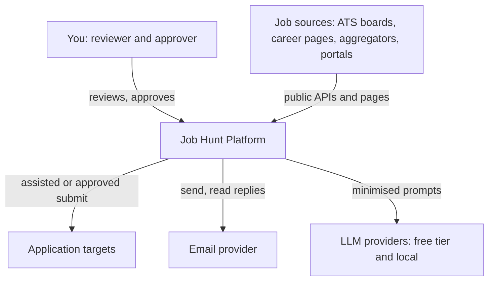
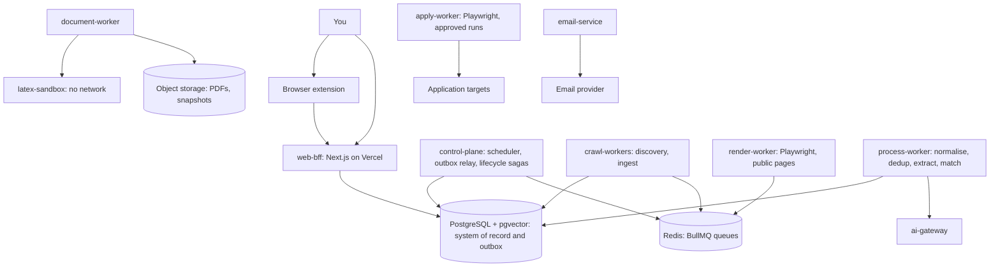
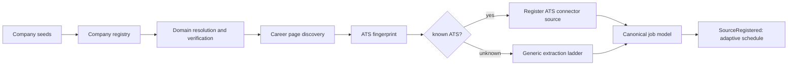
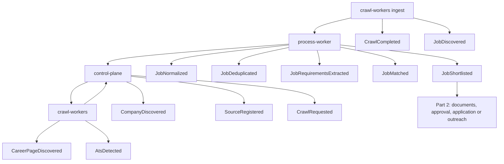

# Job Hunt Platform: HLD Part 1

> Foundations, service boundaries, discovery and event backbone · Draft v0.1

> **Scope:** sections 1–10, staged rollout, company / career-page / ATS discovery, event backbone. Later parts cover matching, AI gateway, resume and cover letter, application automation, email, scheduler detail, data and ER, security, observability, failure recovery, deployment.

> **Legend:** `[HLD]` architectural decision · `[LLD]` deferred detail · `[VERIFY]` external fact not confirmed here; check before relying on it.

---

## 1. Executive Summary

A single-user platform that continuously discovers jobs from company career pages, ATS-hosted boards, aggregators and portals; normalises and matches them to your profile; and drives applications or outreach through one human-approved lifecycle.

It starts as a $0 hybrid: cloud UI, database and object storage; local Dockerised workers that only make outbound connections. Services communicate through events, and boundaries are drawn so they can be split later without rewriting business logic.

**Four shifts from your two diagrams:**

- Discovery-first ingestion: company → career page → ATS fingerprint → connector or generic extractor. No per-company scrapers.
- Postgres is the cloud/local meeting point; nothing local accepts inbound traffic.
- Every state change emits an event via a transactional outbox; the queue only delivers.
- Human approval and idempotency belong to the lifecycle, not to individual workers.

## 2. Problem Statement

Jobs are spread across portals, aggregators, ATS boards and thousands of custom career pages. Checking by hand is slow, and one-scraper-per-site rots. The platform needs discovery that generalises (one connector per ATS, one extractor for the long tail) while keeping applications and outreach safe: no duplicates, no fabricated claims, no spam.

## 3. Goals

- **G1** Broad discovery from legitimate, accessible sources.
- **G2** Zero per-company code: adding a company or ATS tenant is data, adding an ATS is one connector module.
- **G3** Fresh, deduplicated, attributable jobs.
- **G4** Explainable matching that never invents experience.
- **G5** Every application and email traceable to exact resume and cover-letter versions.
- **G6** One lifecycle for portal application, career-page application and email outreach.
- **G7** $0 recurring cost with a migration path to paid infrastructure.
- **G8** Teach real enterprise patterns to one developer.

## 4. Non-Goals

- Multi-tenant SaaS.
- Bypassing CAPTCHA, OTP, MFA, anti-bot controls or authentication.
- Collecting private or leaked personal data (public business contacts only).
- Bulk or blind outreach.
- Full coverage of portals that prohibit automated access.
- Submitting anything without approval (default).

## 5. Functional Requirements

| ID | Area | Requirement |
|----|------|-------------|
| F1 | Discovery | Discover companies, career pages and ATS tenants beyond a manual list |
| F2 | Ingestion | ATS connectors, aggregator APIs, generic career-page extraction, scheduled and incremental |
| F3 | Freshness | Detect new, updated and expired jobs per source |
| F4 | Processing | Normalise to a canonical model; deduplicate across sources; keep source attribution |
| F5 | Matching | Hard filters first, then semantic fit; separate required/preferred/missing skills |
| F6 | Documents | LaTeX master resume, per-job tailoring, versioned PDFs, cover letters |
| F7 | Applications | Assisted (extension) and automated (Playwright) paths with approval gate |
| F8 | Outreach | Public contact discovery, drafted emails, limits, suppression, thread tracking |
| F9 | Tracking | Correlate replies, bounces and interviews back to job, contact, resume version |
| F10 | Operations | Scheduler, health monitoring, audit trail, notifications |

## 6. Non-Functional Requirements

| Quality | Initial target |
|---------|----------------|
| Safety invariant | A job is never submitted twice; nothing external is sent without approval |
| Durability | No lost work if the local machine is off; resume from Postgres state |
| Extensibility | New ATS = one connector + fingerprint rule + registry row; no core changes |
| Freshness | Tiered by source; tuned from observed change rates `[LLD]` |
| Security | Untrusted external content never treated as instructions; PII minimised in events and logs |
| Cost | $0 recurring; every free-tier dependency behind a replaceable port |
| Observability | Every job traceable from discovery to outcome via correlation ID |

## 7. Assumptions

- One user, one candidate profile; local machine is not always on.
- Supabase or Neon free Postgres with pgvector `[VERIFY]` current limits: storage cap, inactivity pausing or scale-to-zero, connection limits.
- Vercel free plan suits a personal, non-commercial UI `[VERIFY]` terms.
- Free LLM tiers may log or train on prompts and change models without notice `[VERIFY]`; candidate PII is minimised before any external call.
- Aggregator (Adzuna, Jooble) and ATS access needs keys or public endpoints whose terms must be checked `[VERIFY]`.

## 8. Architecture Principles

- Discover, don't hard-code: sources come from data (registry), behaviour from a small set of connectors.
- Rules first, AI where rules run out: LLMs never replace deterministic checks, and never invent candidate facts.
- Postgres is the system of record; queues and caches are rebuildable.
- Events are facts, commands are requests; state change and event are one transaction (outbox).
- Outbound-only workers: no tunnels, no exposed home machine.
- Untrusted by default: job pages, PDFs and emails are data, never instructions.
- Ports and adapters: queue, LLM, email, storage sit behind interfaces so free → paid is a config change.
- Split by reason, not by fashion: a boundary must earn its place via scaling, blast radius, trust zone or release cadence.
- Human in the loop for anything external and irreversible.

## 9. System Context

## 10. Container / Service Architecture

### 10.1 Zones

- **Local zone:** Docker, outbound connections only.
- **Cloud zone:** free tiers.

> **Notes:** the extension talks to the cloud BFF (no localhost dependency). The UI never calls local services; it writes commands and approvals to Postgres, and the control-plane's outbox relay picks them up. Redis is local, so there is no command quota. Upstash stays an optional later swap `[VERIFY quotas]`.

### 10.2 Service responsibilities

| Service | Responsibility | Owns (schema) | Consumes → Produces (Part 1 events) |
|---------|----------------|---------------|--------------------------------------|
| web-bff | UI, thin BFF, commands and approvals | none (reads projections) | – |
| control-plane | Scheduler, outbox relay, lifecycle state machines, notifications | platform, sched | `AtsDetected`, `JobShortlisted` → `SourceRegistered`, `CrawlRequested` |
| crawl-workers | Company/career-page discovery, ATS fingerprinting, connectors | discovery, ingest | `CompanySeeded`, `CrawlRequested` → `CompanyDiscovered`, `CareerPageDiscovered`, `AtsDetected`, `JobDiscovered`, `CrawlCompleted/Failed` |
| render-worker | JS rendering of public pages only, no credentials | none | render requests → rendered snapshots |
| process-worker | Normalise, dedup, requirement extraction, matching | jobs | `JobDiscovered` → `JobNormalized`, `JobDeduplicated`, `JobUpdated`, `JobExpired`, `JobRequirementsExtracted`, `JobMatched`, `JobShortlisted` |
| ai-gateway | All LLM traffic: routing, limits, cache, cost, prompt versions | ai | – (request/response) |
| document-worker + latex-sandbox | Resume and cover letter (Part 2) | docs | `JobShortlisted` → documents |
| apply-worker | Approved form filling in isolated browser contexts (Part 2) | apply | approvals → outcomes |
| email-service | Provider abstraction, threads, replies (Part 2) | outreach | approvals → delivery events |

> **Rule:** services write only to their own schema; cross-schema access is by events or read-only views. Separate databases per service come at Stage 4.

### 10.3 Staged progression

| Stage | Deployables | Why |
|-------|-------------|-----|
| 1. MVP (discover → match) | web-bff, control-plane, crawl-workers, process-worker; AI gateway as an in-process module with a strict interface | Fewest moving parts; boundaries exist as modules and queues |
| 2. Isolate by risk | render-worker, ai-gateway, document-worker + latex-sandbox, apply-worker, email-service | Memory-heavy browsers, shared LLM quota, untrusted PDFs, authenticated sessions each justify isolation |
| 3. Isolate by load | Split discovery from ingest, matching from process; enforce schema-per-service | Different scaling profiles and failure blast radius |
| 4. Enterprise | Database per service, event log with replay (Kafka-class) if needed, API gateway, IaC | Only when volume, team size or replay needs justify it |

> A boundary is split only if one of these is true: different scaling profile, different failure blast radius, different trust zone, different release cadence.

---

## Discovery Architecture

### Flow

### Generic extraction ladder

1. **T1** JSON-LD JobPosting
2. **T2** Sitemap or feeds
3. **T3** Static HTML via learned site profile
4. **T4** Playwright render
5. **T5** Manual or paste URL

### Company seeds

Manual additions; pasted job or career URLs (fingerprinted immediately); public directories and startup datasets (license `[VERIFY]`); companies observed inside aggregator and ATS results (best yield, no extra requests); search-engine discovery only through permitted APIs `[VERIFY]`, never by scraping results pages.

### Career-page discovery (deterministic first)

Try well-known paths (`/careers`, `/jobs`, `/join-us`), homepage and footer links, `robots.txt` and sitemaps, common subdomains (`careers.`, `jobs.`), and outbound links to ATS hosts. An LLM may classify ambiguous candidate pages, with output limited to a fixed enum.

### ATS fingerprinting

Signals in decreasing confidence:

1. hostname or path pattern such as `{tenant}.greenhouse.io`, `jobs.lever.co/{tenant}`, or a spoke domain such as `careers.techmahindra.com` linked from `techmahindra.com/careers` `[VERIFY patterns per ATS]`;
2. redirects, iframes and script sources;
3. widget markers;
4. HTML and header signatures.

Fingerprint rules are data in the registry, stored as `(ats, tenant, evidence, confidence)`.

### Generic extraction ladder (long tail)

The system uses the cheapest tier that works and records cost and success per source. T3 is the key idea: an LLM proposes an extraction config once per site; a validator tests it against the live page; a deterministic engine runs it on every crawl; drift detection triggers re-learning. LLM cost is paid at onboarding, not per crawl, and its output is a schema-validated config, never free text that gets executed. T4 (Playwright) is a fallback, never the core mechanism.

### Connector contract `[HLD]`

Each ATS connector implements: `fingerprint(url)`, `listJobs(source, cursor)`, `getJob(source, externalId)`, `capabilities()` (incremental support, expiry signal). Adding an ATS = one module + fingerprint rule + registry row. Scheduler, processing and schema are untouched.

### Worked examples: your two reference career pages

Reference 1 — talent-pool page with no job list: `https://vidushiinfotech.com/careers/`

- Fetch → WordPress marketing page, no job list, no JobPosting JSON-LD observed.
- Classify → `talent-pool-form`: generic "Career Opportunities" blurb plus application form (Name / Email / Mobile / Role / Experience 0-20 / Resume 50MB / Consent). `Join Now` links are `#` placeholders.
- Register company + `career_page` with `page_class=talent-pool`, zero jobs ingested. Form spec stored for optional assisted general application; dedup/match skipped.
- Access class: public webpage. First LLD spike checks `robots.txt` and terms, confirms absence of JSON-LD/sitemap jobs, then records the form fields. No per-company scraper is built.

Reference 2 — hub page handing off to a spoke ATS: `https://www.techmahindra.com/careers/`

- Fetch → corporate hub page, no jobs listed, only brand content plus `Join Us → https://careers.techmahindra.com/`.
- Classify → `hub-to-spoke`: outbound link to a separate jobs domain.
- Follow → spoke domain becomes the canonical `source`; fingerprint the spoke (ATS pattern, JSON-LD, sitemap) and register it. The hub URL is kept as `discovered_via`, never as a job source itself.
- Job identity = `(source_id, external_id)` on the spoke (e.g. spoke listing ID or canonicalised apply URL). Tenant/domain is always part of identity.
- Keka note: Keka is one HRMS/ATS among many (Greenhouse, Lever, Ashby, Workable, SuccessFactors). It is handled by the same fingerprint + connector contract above when a career page is Keka-hosted — it is not the reference target. The first reference implementation is the generic JSON-LD / sitemap / form extractor validated against the two URLs above, not a Keka-specific connector.

### Integration access classification

| Source | Access class | Note |
|--------|--------------|------|
| Greenhouse, Lever, Ashby, SmartRecruiters | Public ATS endpoint | `[VERIFY]` current docs and terms |
| Workable, Workday | Public ATS endpoint or public webpage | Tenant-specific; `[VERIFY]` technical and legal fit |
| Keka and other HR-suite ATS hosts (one fingerprint among many) | Public webpage or public ATS endpoint | Handled by generic fingerprint + connector contract; not the reference target |
| Adzuna, Jooble | Official API | Keys and terms `[VERIFY]` |
| LinkedIn, Naukri, Indeed, Glassdoor, Foundit, Instahyre, Hirist | No assumed public API | Likely restrictive terms `[VERIFY]`; treat as manual fallback or user-assisted via extension, never core ingestion |
| Company career pages | Public webpage | JSON-LD and sitemap first |

Freshness and expiry: use conditional requests and sitemap `lastmod` where available; mark a job expired only after it is absent from several consecutive complete listings or shows an explicit closed marker, never after a single miss.

---

## Event Backbone

### Rules

- Events are past-tense facts; commands are `*Requested`. One owner per event type.
- State change and event are written in one DB transaction (outbox); the relay publishes to BullMQ.
- At-least-once delivery, so consumers are idempotent by `event_id`.
- Payloads carry IDs and minimal facts; bulky content stays in Postgres or object storage.
- Additive schema changes only; version in the envelope.
- No PII in payloads or logs, only references.
- Envelope: `event_id`, `type`, `version`, `occurred_at`, `producer`, `correlation_id`, `causation_id`, `idempotency_key`, entity refs, payload.

### Part 1 catalogue

| Event | Producer | Consumers | Meaning |
|-------|----------|-----------|---------|
| CompanySeeded | web-bff, crawl-workers | crawl-workers | Company or URL entered the registry |
| CompanyDiscovered | crawl-workers | control-plane | Verified company and domain |
| CareerPageDiscovered | crawl-workers | crawl-workers | Candidate careers URL found |
| AtsDetected | crawl-workers | control-plane | ATS, tenant, confidence |
| SourceRegistered | control-plane | control-plane | Connector source and schedule created |
| CrawlRequested | control-plane | crawl-workers, render-worker | Source, mode (full or incremental), priority |
| CrawlCompleted / CrawlFailed | crawl-workers | control-plane, process-worker | Stats or failure class |
| JobDiscovered | crawl-workers | process-worker | Raw posting stored, reference emitted |
| JobNormalized | process-worker | process-worker | Canonical job created |
| JobDeduplicated | process-worker | web-bff projection | Linked to canonical job |
| JobUpdated / JobExpired | process-worker | web-bff, control-plane | Change or expiry detected |
| JobRequirementsExtracted | process-worker | process-worker | Required and preferred skills structured |
| JobMatched | process-worker | control-plane | Match result with gaps |
| JobShortlisted | process-worker | control-plane, web-bff | Hand-off to Part 2 lifecycle |

### Part 1 event flow

---

## Key Decisions (Part 1)

| Decision | Chosen | Alternative | Why | Trade-off | Revisit when |
|----------|--------|-------------|-----|-----------|--------------|
| Cloud/local link | Outbound-only workers, Postgres rendezvous | Tunnel to a local API | No exposed machine, survives laptop off | Command latency depends on relay polling | Always-on host available |
| Queue | BullMQ on local Redis behind a port, Postgres outbox | Upstash; Postgres-only queue | No command quota, keeps your stack | Redis must run locally | Workers move to cloud |
| Granularity | Modular, staged split | Many services now | One developer can operate it | Some boundaries are only logical at first | A split trigger is met |
| Long-tail sites | Connector-first ladder + learned site profiles | Per-company scrapers | No per-company code; LLM cost at onboarding | Profiles need drift monitoring | Failure rate rises |
| AI placement | Rules first; LLM behind gateway | Direct LLM calls | Quota, audit, safety in one place | Extra hop | Volume or cost changes |

## Deferred to LLD

Table and index definitions, BullMQ settings, retry and backoff numbers, fingerprint regexes, Playwright selectors, site-profile schema, embedding model and dimension, event JSON schemas, model IDs and provider quotas.

## Next Parts

- **Part 2:** job processing, dedup, matching, AI gateway, scheduler and queue detail
- **Part 3:** resume and cover letter, application automation and safety, email outreach and response tracking, unified lifecycle
- **Part 4:** database and ER diagram, search, storage, security, PII, observability, failure recovery, deployment, roadmap, final decision table
