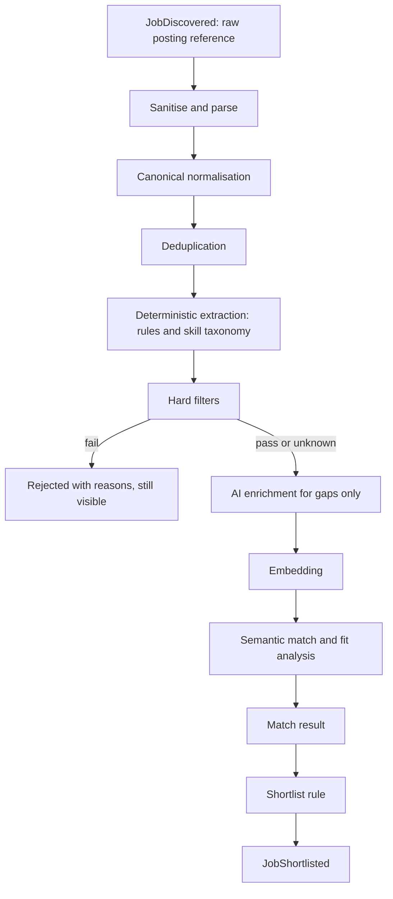
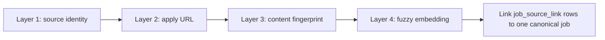
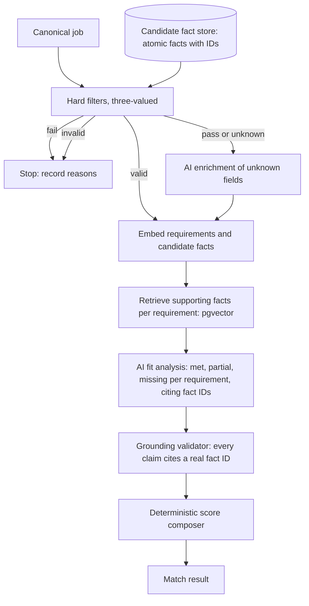
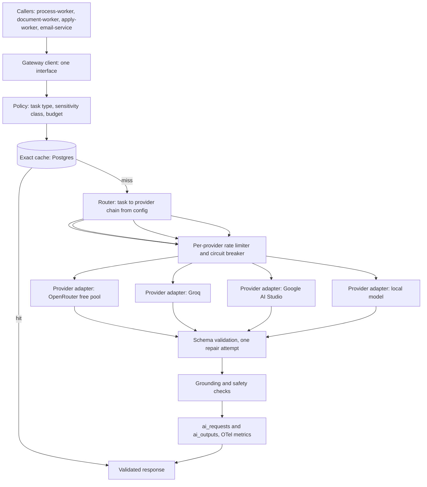
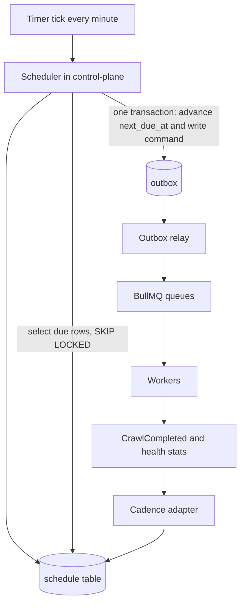
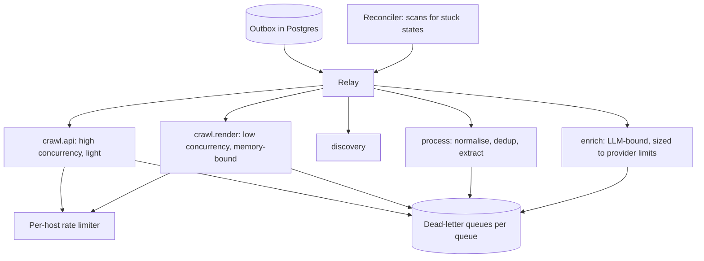

# Job Hunt Platform: HLD Part 2

**Job processing, deduplication, matching, AI gateway, scheduler and queues · Draft v0.1**

**Legend:** `[HLD]` architectural decision · `[LLD]` deferred detail · `[VERIFY]` external fact not confirmed here.

**Changes to Part 1's event catalogue:** filtering now happens before LLM enrichment, so `JobRequirementsExtracted` is split into a deterministic pass and an optional enrichment, and two events are added: `JobFilterEvaluated` (pass, fail or unknown, with reasons) and `JobEnriched`.

---

## 11. Job Processing Architecture

### [HLD] Principles

- **Claim-check:** the raw posting (HTML or JSON) is stored once; events carry references. Raw content is retained short-term for re-parsing when parsers improve `[LLD]` retention.
- **Cheapest step first:** normalisation, dedup and rule-based extraction cost nothing. LLM enrichment runs only on jobs that survived hard filters and only for fields the rules could not resolve.
- **Untrusted boundary:** everything from the raw posting is data. Sanitisation strips scripts and hidden text before any model sees it (see AI Gateway).
- **Job state machine:** `DISCOVERED → NORMALIZED → DEDUPED → FILTERED_OUT | ELIGIBLE → ENRICHED → MATCHED → SHORTLISTED | REJECTED`, plus `EXPIRED` and `REOPENED`. Every transition is an event, so any job's history is reconstructable.
- **Idempotent stages:** re-processing the same raw posting version yields the same result, so replays and retries are safe.
- **Canonical model [HLD]:** company, title (plus normalised role family and seniority), location set (with remote/hybrid/onsite), employment type, salary range and currency (nullable), experience range (nullable), description (cleaned), apply URLs, posted/updated dates, and `source_attribution`. Nullable means unknown, never zero.

## 16. Deduplication Architecture

Identity is resolved in layers, cheapest and most certain first:

| Layer | Signal | Outcome |
|-------|--------|---------|
| 1. Source identity | `(source_id, external_id)`, e.g. `(greenhouse:acme, 12345)` or `(spoke-domain, listing-id)` | Same listing re-seen: update or no-op, never a new job |
| 2. Apply URL | Canonicalised URL (tracking parameters stripped) | Strong cross-source match |
| 3. Content fingerprint | Normalised company + title + location set + description hash | Exact repost across sources |
| 4. Fuzzy | Embedding similarity within the same company only | Candidate duplicates, scored |

### [HLD] Decisions

- Blocking by company keeps comparison cost near-linear instead of comparing every job to every job. This depends on reliable company resolution, which is why the company registry (Part 1) is a dependency of dedup.
- Merge is a link, not a deletion: many `job_source_link` rows point to one canonical job. Merges are reversible, and you can mark "not a duplicate."
- Authority order for the canonical apply URL: ATS direct > company career page > aggregator > portal.
- Distinct openings are not duplicates: same title in different locations or teams stays separate unless the fields agree. Thresholds are tuned against a labelled sample `[LLD]`.
- Part 1 used a slug hash of company + title + location as the primary key; that is demoted to layer 3 because title variants and multi-location postings break it.

## 17. Matching Architecture

### What belongs where

| Concern | Layer | Notes |
|---------|-------|-------|
| Location, remote/hybrid, employment type | Deterministic | Compatibility sets you define |
| Salary | Deterministic | Missing salary is unknown, not fail |
| Experience range vs your years | Deterministic | Extraction by rules; ambiguous phrasing is unknown |
| Mandatory technologies | Deterministic | Skill taxonomy; "required" only when the wording says so, otherwise unknown |
| Role family and seniority | Deterministic, taxonomy | LLM only to classify unmapped titles |
| Requirement structuring (required vs preferred) | Rules, then AI for gaps | Output is schema-validated |
| Semantic similarity | Embeddings (local model) | Model name and version stored with every vector |
| Per-requirement fit judgment | AI | Grounded on candidate facts only |
| Final score | Deterministic | Formula over per-requirement results, not an LLM-chosen number |

### [HLD] Anti-fabrication design

- **Candidate fact store:** your skills, roles, dates and achievements as atomic facts with IDs, authored or approved by you. It is the only source of claims about you, and Part 3's resume and cover-letter engines use the same store.
- The fit-analysis model must cite fact IDs for every "met" or "partial." The grounding validator rejects any claim without a valid ID and retries once, then falls back to "unknown" rather than guessing.
- Three-valued logic (`PASS` / `FAIL` / `UNKNOWN`): `UNKNOWN` goes forward with a visible flag instead of silently dropping a job you might want.
- Match results show why: per-criterion evidence spans from the posting and cited facts from your profile.
- Shortlist rule is threshold plus manual override; the threshold is tuned from your accept/reject history `[LLD]`.

## 18. AI Gateway Architecture

### [HLD] Responsibilities

- **Single entry point:** no service imports a provider SDK. From Stage 1 the gateway is an in-process module with this exact interface; it becomes its own service at Stage 2 because rate-limit and circuit-breaker state must be shared across workers.
- **Request contract:** task type, prompt ID + version, input references, output schema ID, sensitivity class, budget.
- **Routing is config, not code:** task → ordered provider/model chain. Model IDs and free-tier limits change often, so they live in configuration and are `[VERIFY]` before use.
- **Failure handling:** retry on 429 (honouring `Retry-After`), 5xx and timeouts with backoff and jitter, then fall to the next provider. A circuit breaker per provider/model stops hammering a failing one. Schema failures get one repair attempt, ideally on a different provider; content-policy refusals are not retried.
- **Cache:** exact-match on `hash(prompt version, task, input hash)`, stored in Postgres. This also serves as the audit record and costs no Redis commands. Semantic caching is deferred until measured hit rates justify it.
- **Usage and cost:** tokens, latency, provider, estimated cost (zero on free tiers) per request; quota headroom is exposed so schedulers can back off.
- **Evaluation:** golden sets per task (requirement extraction, fit analysis, classification); every prompt or model change runs against them, and new models can shadow-run before promotion.

### Sensitivity classes and prompt-injection defence

| Class | Content | Eligible providers |
|-------|---------|-------------------|
| public | Job text alone | Any configured provider |
| restricted | Candidate facts, resume text, contacts | Local model, or providers whose terms exclude training and retention `[VERIFY]` |

- **Data minimisation:** names and contact details are stripped before restricted prompts; the mapping stays local.
- Untrusted content (job text, career pages, form HTML, inbound email) is passed only as delimited data, never in the system role. Models that read untrusted text get no tools and can only return schema-validated JSON, so injected instructions cannot trigger actions. Instruction-like text is flagged in the audit record.
- Extraction configs proposed by an LLM (Part 1's site profiles) are validated against a schema and tested before use.

### Use-case map (rules first)

| Use case | Deterministic first | AI role | Class |
|----------|---------------------|---------|-------|
| Requirement extraction | Regex, skill taxonomy | Fill gaps | public |
| Semantic matching | Hard filters, embeddings | Fit judgments | restricted |
| Resume tailoring | Fact store selection, LaTeX templates | Wording within facts | restricted |
| Cover letter, email drafts | Templates, variables | Personalisation within facts | restricted |
| Career-page classification | URL heuristics, fingerprints | Ambiguous pages | public |
| Contact classification | Address patterns (`careers@`, `hr@`) | Ambiguous cases | public |
| Form-field classification | `autocomplete` attributes, labels | Ambiguous fields | public |
| Application answers | Stored answers from fact store | New questions, drafted for approval | restricted |
| Reply classification | Bounce codes, headers | Intent from reply text | restricted |

## 24. Scheduler / Cron Architecture

### [HLD] Design

- Cron never does work. The tick only selects due schedules and writes commands to the outbox; workers do everything else.
- Durable schedule state lives in Postgres: target (source, company, follow-up), priority, base cadence, `next_due_at`, jitter, backoff state, last outcome.
- Single-flight per target: a schedule with a run in flight is skipped, so slow crawls never stack.
- Catch-up with coalescing: if the machine was off for a day, each schedule runs once when it wakes, not once per missed window, and start times are jittered to avoid a burst.
- Optional cloud tick `[VERIFY]`: a free cloud scheduler could write due commands into Postgres while the local machine is off, so work is queued when it returns. Execution still happens locally.

### Source-aware cadence (starting priors, then adaptive)

Your proposed frequencies are reasonable starting points, but a fixed cadence wastes quota and politeness budget on sources that rarely change. Cadence is a function of observed change rate, crawl cost, source limits and yield (how often the source produces jobs that match you).

| Target | Starting cadence | Reasoning | Adaptive rule |
|--------|------------------|-----------|---------------|
| High-yield ATS boards (cheap list calls) | 2–6 h | Early applicants have an edge; calls are cheap | Lengthen after repeated no-change crawls; shorten on change |
| Other ATS tenants | 6–12 h | Most companies post a few roles a week | Same |
| Career pages (JSON-LD, sitemap, static) | 12–24 h | Slow-changing; use conditional requests and sitemap lastmod | Cap at a few days |
| Pages needing render | 24 h | Expensive, memory-heavy | Only if yield justifies |
| Aggregator APIs | Quota-budgeted windows | Daily request caps `[VERIFY]` | Spread budget by yield |
| Portals | Not scheduled by default | Terms likely restrict automation `[VERIFY]` | Manual or extension-assisted |
| Company discovery, registry refresh | Weekly | Low churn | – |
| Career-URL health, connector health | Weekly, plus on failure | Detect broken pages early | Failure triggers an early check |
| ATS re-fingerprint | Monthly or on repeated failure | Companies change ATS rarely | – |
| Expiry check | Part of each full crawl | Uses absent-from-N-listings rule (Part 1) | – |
| Follow-up eligibility, reminders | Daily | Human-scale timing | – |

## 26. Queue Architecture

### [HLD] Decisions

- Queues by workload class, not by service. Concurrency and retry policy differ by workload: cheap API crawls, heavy renders, LLM-bound enrichment (concurrency tied to provider limits).
- Per-host rate limiter shared by every crawler, including render-worker, so no site is hit faster than its policy or `robots.txt` allows. Whether BullMQ's built-in grouping applies to your edition is `[VERIFY]`; otherwise the limiter is a small shared component `[LLD]`.
- Redis is disposable. Postgres holds truth. A reconciler finds jobs stuck in a state past a threshold and re-emits their commands, so a lost queue or crashed worker loses no work.
- Backpressure: bounded queue depth; the scheduler skips enqueues when a queue is saturated.
- Ports: callers use a queue interface, so a Postgres-backed or managed queue can replace BullMQ without touching business logic.

### Retry policy

| Failure | Action |
|---------|--------|
| Network error, timeout, 5xx | Retry with exponential backoff and jitter, bounded |
| 429 | Retry after `Retry-After`; lower that source's cadence |
| Browser crash, worker crash | Retry; job becomes visible again after its lock expires |
| 404 on a job page | Do not retry; mark the listing removed (expiry rules apply) |
| 401 or 403 | Do not retry; flag the source. Never work around blocks |
| robots.txt disallow | Do not retry; suppress the path |
| Malformed posting | Do not retry; dead-letter with parser error for re-parse later |
| Schema-invalid AI output | One repair attempt, then dead-letter |

Dead-letter queues are inspectable in the UI, with replay after a fix. Repeated identical failures mark a poison message and stop retrying.

---

## Key Decisions (Part 2)

| Decision | Chosen | Alternative | Why | Trade-off | Revisit when |
|----------|--------|-------------|-----|-----------|--------------|
| Filter vs LLM order | Deterministic filters first, LLM on survivors | Enrich every job | Saves scarce free-tier quota | More states to track | Filters prove too coarse |
| Unknown handling | Three-valued logic | Fail on missing data | Doesn't lose good jobs | Some noise in the shortlist | Noise too high |
| Dedup | Layered identity, company blocking | Slug hash only | Handles variants and cross-source | Needs reliable company resolution | Volume grows |
| Anti-fabrication | Fact store + cited IDs + validator | Prompt-only rules | Verifiable, auditable | Upfront profile work | – |
| Scoring | Deterministic composer | LLM-assigned score | Stable, explainable | Formula tuning | Enough history to learn weights |
| AI data safety | Sensitivity classes and routing | One provider for all | Protects PII on free tiers | Fewer eligible providers for restricted tasks | Paid tier with strong terms |
| Cache | Postgres exact cache | Redis semantic cache | Audit trail, no quota use | Lower hit rate | Measured need |
| Scheduler | DB-backed, coalescing, single-flight | In-process cron | Survives restarts and downtime | Slightly more code | – |
| Queue recovery | Outbox + reconciler | Trust Redis | No lost work | Extra background process | – |

## Deferred to LLD

Similarity thresholds and blocking keys, skill taxonomy format, embedding model and dimension, score formula weights, prompt texts and schemas, cache key details, backoff numbers, concurrency values, BullMQ options, rate-limiter algorithm, reconciler thresholds, provider model IDs and quotas.

## Next Parts

- **Part 3:** resume and cover letter engines, application automation and safety, email outreach and response tracking, unified lifecycle, browser security
- **Part 4:** database and ER diagram, search, storage, security and PII, observability, failure recovery, deployment, disaster recovery, roadmap, final decision table
