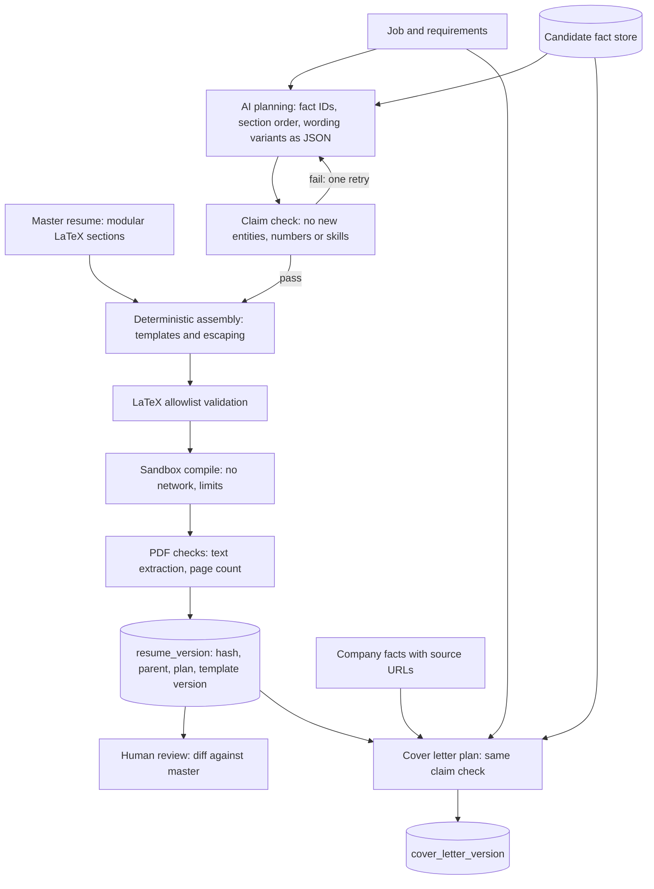
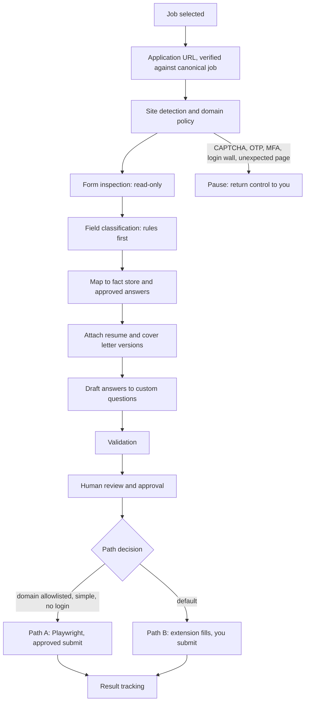
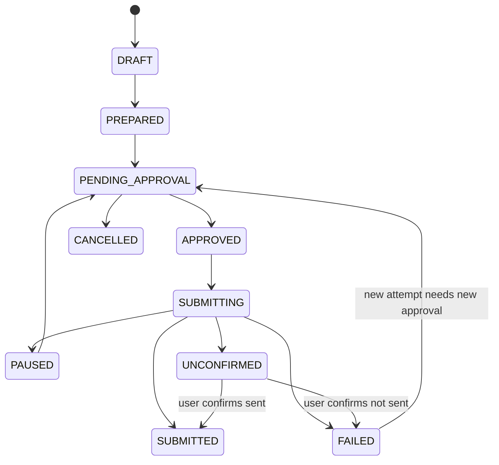
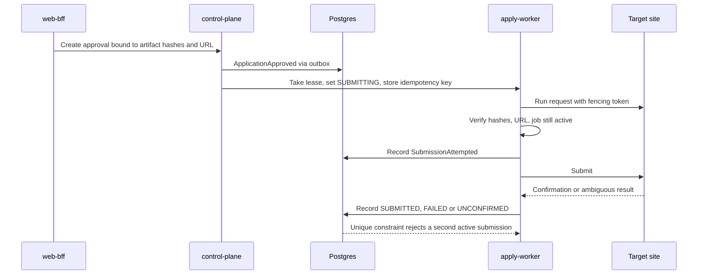
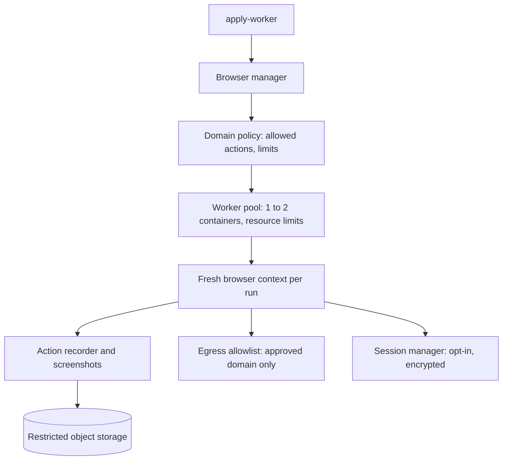
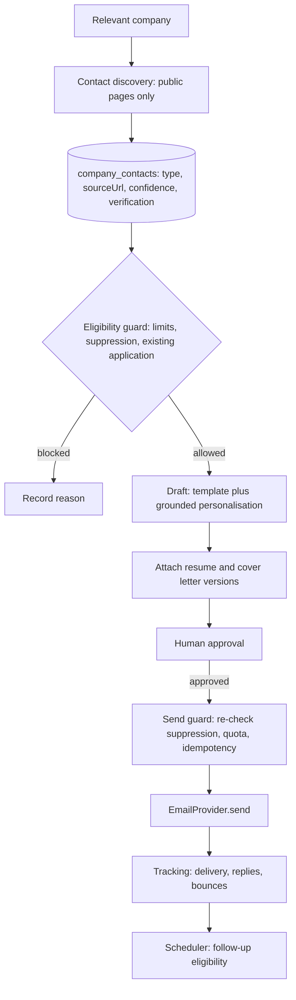
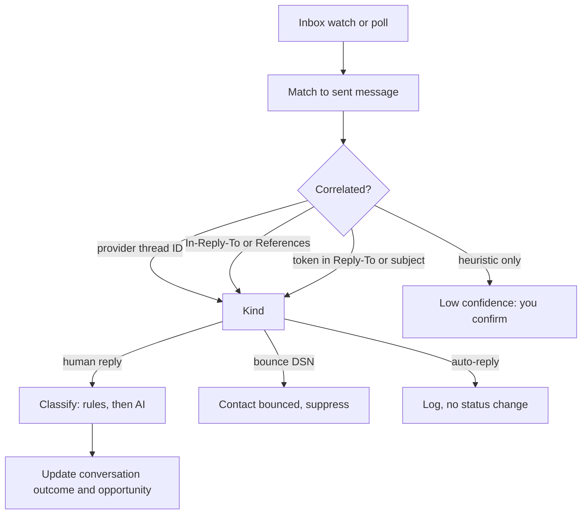
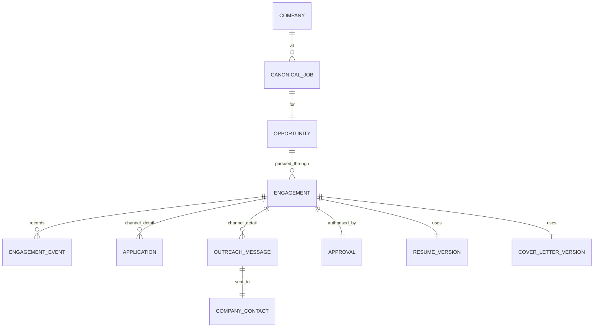

# Job Hunt Platform: HLD Part 3

**Resume and cover letter engines, application automation and safety, browser isolation, email outreach and tracking, unified lifecycle · Draft v0.1**

**Legend:** `[HLD]` architectural decision · `[LLD]` deferred detail · `[VERIFY]` external fact not confirmed here.

## Services in scope

| Service (Part 1) | Owns | Consumes → Produces | Stage |
|------------------|------|---------------------|-------|
| document-worker + latex-sandbox | docs | `JobShortlisted`, `ResumeGenerationRequested` → `ResumeGenerated`, `ResumeCompilationFailed`, `CoverLetterGenerated` | 2 |
| apply-worker | apply | `ApplicationApproved` → `ApplicationSubmitted`, `ApplicationFailed`, `ApplicationPaused` | 2 |
| email-service | outreach | `EmailApproved`, inbox events → `EmailSent`, `EmailDelivered`, `EmailBounced`, `EmailReplied` | 2 |
| control-plane (Part 1) | platform | Approvals and lifecycle events → engagement state transitions | 1 |

---

## 19–20. Resume and Cover Letter Architecture



### [HLD] Resume

- The AI produces a plan, not LaTeX. Its output is JSON: which fact IDs to include, in what order, and which pre-approved wording variant to use. Raw LaTeX is never generated by a model, so injected text cannot reach the compiler.
- Claim check (deterministic): any rewording is compared against its cited facts; new companies, titles, dates, numbers or skills fail the check.
- Assembly is templating, including LaTeX character escaping, so compile failures are rare and deterministic.
- Validation before compile: allowlist of commands and packages; reject anything that reads files, writes files or runs commands.
- Sandbox: ephemeral container, `--no-shell-escape`, no network, read-only filesystem apart from a scratch directory, CPU/memory/time limits `[LLD]`. A compile failure is not retried blindly; it is dead-lettered with the log.
- Versions are immutable: content hash, parent version, job, plan JSON, template version and fact-store snapshot. You can diff against the master and against the previous version. Every engagement records exactly one resume version.
- Modular master: sections and bullets are separate files keyed to fact IDs, so tailoring selects and orders rather than rewrites.

```json
{
  "resume_version": {
    "content_hash": "sha256:...",
    "parent_version": "v12",
    "job_id": "job_123",
    "plan": { "fact_ids": ["exp_01", "proj_04"], "order": ["summary", "experience"] },
    "template_version": "resume-tpl-v3"
  }
}
```

### [HLD] Cover letter

- Inputs: fact store, job, company facts, resume version. Canonical form is Markdown; PDF renders through the same sandbox.
- Company claims must cite a source URL stored in the company registry; unsourced claims about the company fail the check.
- Editable and auditable: your edits create a new version (`edited_by=user`) with a diff. Nothing external is sent without approval.

## 21. Application Automation Architecture



### When to use each path

| | Path A: Playwright | Path B: browser extension |
|---|---|---|
| Use when | Domain policy allows it; simple, unauthenticated form; no CAPTCHA; low risk | Default. Login required, complex or unfamiliar form, anything uncertain |
| Session | Fresh isolated context, no stored credentials | Your own logged-in browser |
| Who submits | Worker, after approval bound to exact values | You click submit |
| Inspection | Read-only, in the worker | In the extension at fill time |

Path A is opt-in per domain; Path B is the default. Your original diagrams defaulted to automated submit, and this reverses that.

### [HLD] Field handling

- Rules first: `autocomplete` attributes, input types, label dictionaries, and per-ATS field maps. AI classifies only ambiguous fields and drafts only free-text answers, both marked for review.
- Sensitive questions (work authorisation, disclosures, demographic, legal attestations) are answered only from your stored explicit answers, or the run pauses to ask you. They are never generated.
- Stop conditions: CAPTCHA, OTP, MFA, login wall, changed layout, or unexpected content pause the run and hand control to you. There is no bypass, evasion or credential workaround.
- Where an ATS offers an official candidate-facing submit API, it is used only after `[VERIFY]`; none is assumed.

### Application state machine



Email engagements use the same states, with `SENDING` in place of `SUBMITTING`.

## 22. Application Safety: no duplicate submissions



### [HLD] Layers of defence

- Database is the authority. A unique constraint allows only one active or completed application per candidate and canonical job. A Redis lock alone is not enough, since Redis is disposable; locks are leases in Postgres with a fencing token, so a stale worker cannot act.
- Idempotency key = hash of candidate, canonical job, target URL, resume version and approval ID, created at approval.
- Approval is bound to exact artifacts: resume hash, cover letter hash, field values, target URL. Any change invalidates it. Approvals are single-use and expire.
- Pre-submit verification: artifact hashes match, target URL matches the approved domain and path, and the job is still active.
- Write-ahead attempt record: `SubmissionAttempted` is stored before the click, the outcome after.
- Ambiguous outcomes never auto-retry. A timeout after the click, or a crash between attempt and outcome, becomes `UNCONFIRMED` and needs your confirmation. This is the rule that stops retries from double-submitting.
- Cross-source protection: Part 2's dedup maps the same job seen via a portal and a career page to one canonical job, so the constraint holds across sources.

## 33. Browser Automation and Browser Security



- Two separate pools: render-worker (public pages, anonymous, Part 1) and apply-worker (your PII). They have different trust levels and never share a browser, profile or container.
- Isolation: new context per run with no shared cookies; short-lived containers recycled after a few runs; low concurrency; downloads and popups blocked; uploads limited to approved artifacts; egress restricted to the approved domain and its assets `[LLD]`.
- Untrusted pages: DOM content is data. Model output is never evaluated as code or used as selectors without validation.
- Sessions and credentials: authenticated flows prefer Path B, so the platform stores no site passwords at MVP. If persistence is ever needed, it is opt-in per domain with encrypted storage state `[LLD]`.
- Action recorder: structured actions with sensitive values redacted; screenshots before submit and on error. Screenshots contain PII, so they go to restricted storage with short retention.
- Recovery: crash before `SUBMITTING` retries; crash after becomes `UNCONFIRMED`. Page change pauses with a screenshot.

## 22–23. Email Outreach Architecture



### Contact discovery [HLD]

- Sources: the company's own website only: contact page, careers page, footer, `mailto:` links, and structured data such as `Organization` or `ContactPoint`. `robots.txt` and site terms are respected.
- Recorded: contact, `contactType`, `sourceUrl`, `discoveredAt`, confidence, `verificationStatus` (`UNVERIFIED`, `SOURCE_CONFIRMED`, `BOUNCED`, `SUPPRESSED`).
- Classification: deterministic patterns (`careers@`, `hr@`, `jobs@`) first; AI only for ambiguous pages.
- Explicitly excluded: guessing personal addresses (first.last@), third-party enrichment, harvested or leaked data, and mailbox-probing "verification". Verification comes from the source page plus bounce feedback.
- Cold-email rules vary by jurisdiction (for example CAN-SPAM, GDPR/ePrivacy, India's DPDP Act). Compliance is `[VERIFY]` before sending anything at scale.

### Eligibility and send guards [HLD]

Deterministic, and checked at both draft time and send time:

- Per-company and per-day limits, with numbers in configuration `[LLD]`.
- Contact and domain suppression list: any opt-out request or hard bounce suppresses permanently.
- Deduplicate by contact and by company window.
- Skip outreach when an application path exists, unless you override.
- Follow-ups capped and spaced; stop on any reply, bounce or opt-out.
- Human approval by default. The approval binds subject, body, recipient and attachment hashes.

### Provider abstraction and security

- `EmailProvider` port with `send`, `draft`, `reply`, `getThread`, `getMessages`, `watchInbox`, `getDeliveryStatus`, and adapters for Gmail, Outlook (Microsoft Graph) and SMTP.
- Capability flags per adapter: SMTP has no inbox or thread API; delivery status often comes only as bounce messages; watch or push support varies `[VERIFY per provider]`.
- Quotas as budgets: free-tier sending limits differ and change `[VERIFY]`; the send guard tracks them like the AI gateway tracks LLM quota.
- OAuth: authorisation-code flow with PKCE, minimum scopes. Whether personal use of Gmail or Graph scopes needs an app verification step `[VERIFY]`. Refresh tokens are encrypted at rest with a key kept outside the database, so a database leak alone does not expose mailbox access `[LLD]`.

## 23. Response Tracking Architecture



### [HLD]

- Correlation chain: company → job → opportunity → engagement → outreach message → thread → response. Each outbound message stores the provider thread ID and RFC Message-ID; replies match by thread ID, then `In-Reply-To`/`References`, then a token fallback, and heuristic-only matches wait for your confirmation.
- Two independent status dimensions, not one enum: delivery (`SENT`, `DELIVERED`, `BOUNCED`, `OPENED`) and conversation outcome (`REPLIED`, `INTERESTED`, `REJECTED`, `INTERVIEW`, `FOLLOW_UP_REQUIRED`, `NO_RESPONSE`). `NO_RESPONSE` is derived by the scheduler after a waiting period.
- Opens are not tracked by default. Tracking pixels are invasive and unreliable; it is an optional, off-by-default capability where a provider offers it.
- Bounces: parse delivery-status notifications; hard bounces suppress the contact, soft bounces retry within limits.
- Classification: rules first (auto-reply headers, out-of-office phrases, unsubscribe wording), then AI for intent under the restricted class from Part 2, with low-confidence results routed to you.

## 13. Unified Application and Outreach Model



- Opportunity = one candidate + one canonical job. Each engagement is one attempt through a channel: `PORTAL_APPLICATION`, `CAREER_APPLICATION` or `EMAIL_OUTREACH`. All share the same job, company, candidate, resume version and cover letter version.
- Rollup: engagement outcomes drive the opportunity status (for example an interview reply moves it to interviewing). Rules: one application per canonical job; outreach after an application needs your override; an interested reply can convert into a tracked application.
- Channel-specific detail lives in `application` and `outreach_message`; common state, approvals and audit sit on the engagement. Part 4 gives the full relational design.

### Event catalogue additions (Part 3)

| Event | Producer | Consumers |
|-------|----------|-----------|
| ResumeGenerationRequested, CoverLetterGenerationRequested | control-plane | document-worker |
| ResumeGenerated, ResumeCompilationFailed, CoverLetterGenerated | document-worker | control-plane, web-bff |
| ApplicationPreparationRequested | control-plane | apply-worker |
| ApplicationPrepared, HumanReviewRequested | apply-worker, control-plane | web-bff |
| ApplicationApproved | web-bff (your action) | control-plane |
| ApplicationSubmitted, ApplicationFailed, ApplicationPaused | apply-worker | control-plane, web-bff |
| OutreachCreated, EmailDrafted | control-plane, email-service | web-bff |
| EmailApproved | web-bff (your action) | email-service |
| EmailSent, EmailDelivered, EmailBounced, EmailReplied | email-service | control-plane, web-bff |
| ReplyClassified | email-service | control-plane |
| InterviewScheduled, OfferReceived, ApplicationRejected | control-plane (from classification or your input) | web-bff |

---

## Key Decisions (Part 3)

| Decision | Chosen | Alternative | Why | Trade-off | Revisit when |
|----------|--------|-------------|-----|-----------|--------------|
| Resume generation | AI plan (JSON) + deterministic LaTeX assembly | AI writes LaTeX | Blocks injection and fabrication | Less free-form tailoring | Plan format proves too limiting |
| Claims | Fact IDs + claim check | Prompt rules | Verifiable, auditable | Upfront fact-store effort | – |
| Approval | Bound to artifact hashes, single-use | Simple "approve" flag | Cannot approve one thing and send another | More states | – |
| Submit path | Extension default, Playwright opt-in per domain | Auto-submit default | Safe for logins and unknown forms | More manual clicks | Domains prove reliable |
| Duplicate prevention | DB unique constraint + leases + idempotency | Redis lock | Redis is disposable | More DB design | – |
| Ambiguous outcome | UNCONFIRMED, manual resolution | Auto-retry | Never double-submits | Occasional manual check | – |
| Email status | Delivery and outcome as two dimensions | One status enum | They change independently | Two fields | – |
| Contact discovery | Public site sources, no guessing | Enrichment services | Legal and ethical safety | Fewer contacts | Verified compliant source exists |
| Open tracking | Off by default | Tracking pixels | Privacy, reliability | Less signal | You want it and provider supports it |
| Lifecycle | Opportunity + engagements | Separate application and outreach models | One audit trail and rollup | Slightly more abstract | – |

## Deferred to LLD

LaTeX allowlist contents, container flags and limits, plan and claim-check schemas, approval and lease schemas, state-transition tables, idempotency key format, field-map formats, Playwright selectors and timeouts, egress rules, OAuth scopes and token encryption details, DSN parsing rules, correlation token format, quota numbers.

## Next Part

- **Part 4:** database and ER diagram (indexes, constraints, JSONB use, pgvector), search, storage, security and PII, observability, failure recovery, deployment, disaster recovery, data retention, roadmap, final architecture and decision summary
