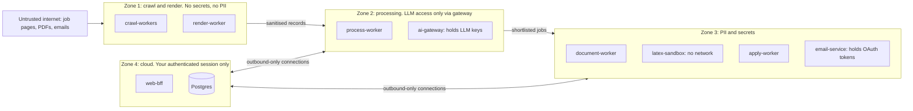
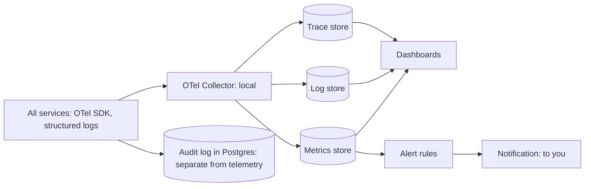
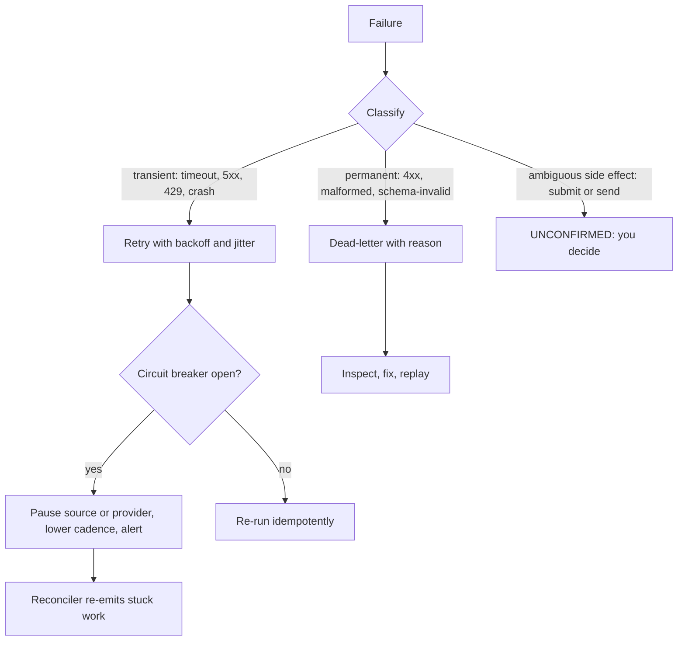
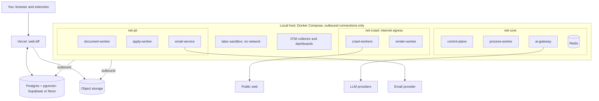
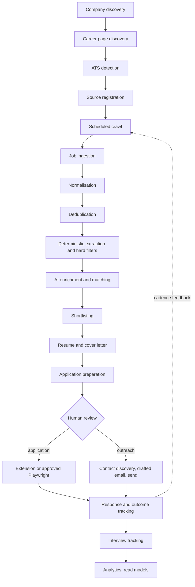

# Job Hunt Platform: HLD Part 4
**Data, search, storage, security and PII, observability, failure recovery, deployment, DR and retention, roadmap, final architecture** · Draft v0.1

Legend: **[HLD]** architectural decision · **[LLD]** deferred detail · **[VERIFY]** external fact not confirmed here.

---

## 27–28. Database Architecture and ER Diagram

### Conventions [HLD]
- **One PostgreSQL, schema per service** (`platform`, `sched`, `discovery`, `ingest`, `jobs`, `docs`, `apply`, `outreach`, `ai`, `audit`). A service writes only to its own schema; each service gets its own DB role with least privilege. Splitting into separate databases is Stage 4.
- **Keys and timestamps:** time-ordered UUID primary keys (UUIDv7-style **[LLD]**), `created_at`, `updated_at`, `created_by` / `updated_by` (actor type: user, system, service), `row_version` for optimistic concurrency on state-bearing rows.
- **Soft deletion** (`deleted_at`) only for user-facing entities: companies, contacts, opportunities, notes. **Append-only, never deleted:** events, audit logs, resume and cover-letter versions, suppression entries.
- **Status columns** use `CHECK` constraints or lookup tables, never free text. Foreign keys default to `ON DELETE RESTRICT`.
- **Polymorphic references** (`target_type` + `target_id`) are avoided: use typed nullable FKs with a `CHECK` that exactly one is set, so integrity stays enforced.
- **Merged tables:** `ingestion_runs` is folded into `crawl_runs` (one row per source run with stats), and `application_events` into `engagement_events`, because separate tables would duplicate the same audit shape. `application_runs` records each browser attempt.

```mermaid
erDiagram
  USERS ||--|| CANDIDATE_PROFILES : has
  USERS ||--o{ EMAIL_ACCOUNTS : connects
  CANDIDATE_PROFILES ||--o{ CANDIDATE_FACTS : holds
  CANDIDATE_PROFILES ||--o{ CANDIDATE_ANSWERS : stores
  CANDIDATE_FACTS ||--o| FACT_EMBEDDINGS : embedded_as
  COMPANIES ||--o{ COMPANY_DOMAINS : has
  COMPANIES ||--o{ COMPANY_SOURCES : discovered_via
  COMPANIES ||--o{ CAREER_PAGES : has
  COMPANIES ||--o{ COMPANY_CONTACTS : has
  CAREER_PAGES }o--o| ATS_FINGERPRINTS : detected_as
  CAREER_PAGES ||--o| SITE_PROFILES : learned_config
  COMPANIES ||--o{ JOB_SOURCES : owns
  JOB_SOURCES }o--|| SOURCE_CONNECTORS : served_by
  JOB_SOURCES ||--o| SCHEDULES : scheduled_by
  JOB_SOURCES ||--o{ CRAWL_RUNS : has
  CRAWL_RUNS ||--o{ RAW_POSTINGS : fetched
  JOB_SOURCES ||--o{ JOB_SOURCE_LINKS : lists
  JOBS ||--o{ JOB_SOURCE_LINKS : seen_at
  RAW_POSTINGS ||--o{ JOB_SOURCE_LINKS : resolves_to
  COMPANIES ||--o{ JOBS : posts
  JOBS ||--o{ JOB_REQUIREMENTS : has
  JOBS ||--o| JOB_EMBEDDINGS : embedded_as
  JOBS ||--o{ JOB_MATCHES : evaluated
  CANDIDATE_PROFILES ||--o{ JOB_MATCHES : receives
  JOB_MATCHES ||--o{ JOB_MATCH_CRITERIA : explained_by
  RESUMES ||--o{ RESUME_VERSIONS : versions
  RESUME_VERSIONS ||--o| ARTIFACTS : rendered_as
  COVER_LETTERS ||--o{ COVER_LETTER_VERSIONS : versions
  COVER_LETTER_VERSIONS ||--o| ARTIFACTS : rendered_as
  CANDIDATE_PROFILES ||--o{ OPPORTUNITIES : pursues
  JOBS ||--o{ OPPORTUNITIES : target_of
  OPPORTUNITIES ||--o{ ENGAGEMENTS : pursued_through
  ENGAGEMENTS ||--o{ ENGAGEMENT_EVENTS : records
  ENGAGEMENTS }o--|| RESUME_VERSIONS : uses
  ENGAGEMENTS }o--o| COVER_LETTER_VERSIONS : uses
  ENGAGEMENTS ||--o| APPROVALS : authorised_by
  ENGAGEMENTS ||--o| APPLICATIONS : channel_detail
  APPLICATIONS ||--o{ APPLICATION_ANSWERS : has
  APPLICATIONS ||--o{ APPLICATION_RUNS : attempts
  OUTREACH_CAMPAIGNS ||--o{ OUTREACH_MESSAGES : groups
  ENGAGEMENTS ||--o{ OUTREACH_MESSAGES : channel_detail
  OUTREACH_MESSAGES }o--|| COMPANY_CONTACTS : sent_to
  OUTREACH_MESSAGES }o--|| EMAIL_THREADS : in
  EMAIL_THREADS }o--|| EMAIL_ACCOUNTS : via
  EMAIL_THREADS ||--o{ EMAIL_EVENTS : records
  AI_REQUESTS ||--o| AI_OUTPUTS : produces
  SUPPRESSION_ENTRIES {
    string kind
    string value_hash
  }
  OUTBOX_EVENTS {
    uuid id
    timestamp published_at
  }
  PROCESSED_EVENTS {
    string consumer
    uuid event_id
  }
  AUDIT_LOGS {
    uuid id
    string action
  }
  NOTIFICATIONS {
    uuid id
    string kind
  }
  DEAD_LETTERS {
    uuid id
    string queue
  }
```

`SCHEDULES` also targets companies and follow-ups through typed FK columns (one-of `CHECK`), not shown for readability.

### Keys, constraints, indexes (selected) [HLD]
| Table | Constraint or index | Purpose |
|---|---|---|
| `job_source_links` | UNIQUE `(source_id, external_id)` | Same listing is never a new job (Part 2, layer 1) |
| `raw_postings` | UNIQUE `(source_id, external_id, content_hash)` | Re-fetch unchanged content is a no-op |
| `jobs` | `(company_id, status)`; partial index `WHERE status = 'ACTIVE'`; generated `tsvector` with GIN | Company views, active-job lists, full-text search |
| `job_embeddings` | PK `(job_id, model)`; HNSW on the vector | Similar jobs, fuzzy dedup within company |
| `companies` / `company_domains` | UNIQUE normalised domain; trigram index on name | Company resolution for dedup blocking |
| `company_contacts` | UNIQUE `(company_id, lower(value))`; `CHECK` on `contact_type` | No duplicate contacts |
| `suppression_entries` | UNIQUE `(kind, value_hash)`; no update or delete path | Permanent opt-out; stores a hash so the plaintext can be purged |
| `opportunities` | UNIQUE `(candidate_id, job_id)` | One pursuit per job |
| `engagements` | Partial UNIQUE on `(opportunity_id)` where channel is an application and status is `SUBMITTING`, `SUBMITTED` or `UNCONFIRMED`; UNIQUE `idempotency_key` | Database-enforced no-duplicate-submission (Part 3) |
| `approvals` | Bound artifact hashes, `expires_at`, `consumed_at` | Single-use, exact-artifact approval |
| `resume_versions` | UNIQUE `(resume_id, version_no)`; self-FK `parent_version_id`; update blocked by trigger **[LLD]** | Immutable version chain |
| `email_threads`, `outreach_messages` | UNIQUE `(provider, provider_thread_id)`, UNIQUE `rfc_message_id` | Correlation lookups |
| `email_events`, `engagement_events` | Index `(parent_id, occurred_at)`; append-only | Timelines |
| `outbox_events` | Partial index on unpublished rows | Fast relay polling |
| `processed_events` | PK `(consumer, event_id)` | Consumer idempotency |
| `schedules` | Partial index `(next_due_at) WHERE enabled`; UNIQUE per target | Cheap "what is due" query |
| `crawl_runs`, `audit_logs`, `ai_requests` | Index by parent and time; time partitioning later **[LLD]** | Large append-heavy tables |
| `ai_outputs` | UNIQUE `cache_key` | Exact-match AI cache (Part 2) |

### JSONB: where yes, where no
| Use JSONB | Keep relational |
|---|---|
| Raw connector payloads, connector config, site profiles, event payloads, AI request/response bodies, evidence spans, plan JSON for documents | Companies, jobs, requirements, matches and criteria, contacts, engagements, statuses, approvals, versions, anything you filter, join or constrain on |

### pgvector [HLD]
Justified for four things: similar jobs, similar companies, fuzzy dedup within a company, and retrieving supporting candidate facts for a requirement. Each vector row stores the model name and version so re-embedding is possible, and vectors are computed only for jobs that passed hard filters (Part 2). A 384-dimension vector is roughly 1.5 KB per row before index overhead, which matters against free-tier storage caps **[VERIFY]**.

---

## 29. Search Architecture
**PostgreSQL is sufficient initially.** No extra infrastructure at MVP.
- **Keyword and full-text:** generated `tsvector` (title weighted above company above description), GIN index.
- **Filters:** btree and partial indexes on status, location, employment type, salary, company.
- **Fuzzy:** trigram indexes for company and title typos.
- **Semantic, similar jobs and similar companies:** pgvector nearest-neighbour within the same filters.
- **Hybrid ranking:** merge full-text and vector rankings (reciprocal rank fusion **[LLD]**).

**Introduce a dedicated engine only on a measured trigger:** search latency misses your target after indexing and tuning, you need typo-tolerant faceted search across a much larger corpus, or relevance tuning outgrows Postgres ranking. Meilisearch is the lighter first step; OpenSearch only if you need heavy aggregations or scale. Hosting terms and free tiers **[VERIFY]**.

## 30. Storage Architecture
| Prefix | Content | Access | Retention (starting values) |
|---|---|---|---|
| `artifacts/` | Resume and cover-letter PDFs, key = content hash, immutable | Private; short-lived signed URLs issued by the BFF | Kept |
| `snapshots/` | Raw page snapshots and large raw postings | Private, service-only | 30–90 days |
| `screenshots/` | Browser-run evidence (contains PII) | Restricted role | About 30 days after outcome |
| `exports/` | Backups and exports, encrypted | Private | Rotating |

Large raw content goes to object storage with a pointer in Postgres; small payloads stay as JSONB with retention. This keeps the free-tier database small **[VERIFY caps]**. Object-storage free-tier limits **[VERIFY]**.

## 40. Data Retention (starting values, tune in LLD)
| Data | Retention |
|---|---|
| Raw postings and snapshots | 30–90 days |
| Expired jobs | Keep the canonical row and fingerprints; drop full descriptions after a set period |
| AI request/response bodies (may contain restricted data) | About 30 days; keep metadata (tokens, latency, provider, cost) longer |
| Emails and threads | While the opportunity is active, then archive or delete on your choice |
| Screenshots | About 30 days after outcome |
| `outbox_events`, `processed_events` | 7–30 days |
| `crawl_runs` detail | About 90 days, then aggregates |
| Audit logs | Long (about 1–2 years), PII-redacted |
| Suppression entries, resume versions | Kept |

**Forget flow:** deleting a company or contact purges contact data and keeps only the suppression hash, so an opt-out is still honoured.

---

## 31–32. Security and PII Architecture

| Area | Control [HLD] |
|---|---|
| Authentication | Single user through a managed identity provider with MFA **[VERIFY free-tier availability]**; short-lived sessions. Workers use per-service credentials, not user sessions |
| Authorisation | Ownership checks in the app plus Postgres row-level security as defence in depth; per-service DB roles limited to their schema. **Approvals need a user session with recent re-authentication**; workers cannot create them |
| Encryption | TLS everywhere; provider encryption at rest; application-level envelope encryption for OAuth tokens and stored session state, with the key held outside the database **[LLD]** |
| Secrets and API keys | No secrets in the repo or plaintext DB; LLM keys only inside ai-gateway, connector keys only inside ingest, mail tokens only inside email-service; local secret files or encrypted-at-rest tooling, Vercel env vars for the UI |
| CSRF | SameSite cookies plus CSRF tokens on mutations; approval endpoints also require re-auth |
| XSS | Job text and emails rendered as sanitised text; no raw HTML from external sources; strict CSP |
| SQL injection | Parameterised queries only; no SQL built from external content |
| SSRF | Crawlers fetch attacker-influenced URLs, so egress goes through a filtering layer: http(s) only, block private, loopback, link-local and metadata address ranges, resolve-and-pin DNS, re-validate every redirect, cap size and time |
| Rate limiting | Edge limits on the BFF; per-host limits for crawlers (Part 2); per-provider limits for AI and email |
| Malicious websites / job descriptions | Zone 1 has no secrets or PII and is disposable; content is sanitised and treated as data (prompt-injection rules in Part 2) |
| Malicious files | Inbound attachments are never auto-opened; stored by hash and quarantined; PDFs we produce come only from the LaTeX sandbox (Part 3) |
| Browser isolation | Part 3: separate pools, fresh contexts, egress allowlist |
| Supply chain | Lockfiles, dependency audits, pinned container image digests **[LLD]** |
| Audit logging | Append-only: approvals, sends, submissions, auth events, suppression changes, exports; PII-redacted; carries correlation IDs |

**PII classification:** P0 public (job text) · P1 public business contacts · P2 candidate PII (profile, resume, answers) · P3 secrets. Rules: PII appears only in designated tables and objects; events and logs carry references, not values; a redaction filter sits at the logging boundary; AI prompts follow the sensitivity classes in Part 2. Keep an inventory of third-party processors (Vercel, database host, object storage, LLM providers, email provider) with their data terms **[VERIFY]**.

---

## 34. Observability Architecture

**[HLD]** OpenTelemetry for traces, metrics and logs, with a local open-source backend at $0 (a hosted free tier is an option **[VERIFY]**). Trace context rides in the event envelope's `correlation_id`, so one job's trace survives the queue hops. **Audit is separate from telemetry:** audit is a permanent business record; telemetry is sampled and expires.

| Area | Signals | Alert on |
|---|---|---|
| Ingestion | Crawl success per source, jobs new/updated/expired per crawl, freshness lag | Source failing repeatedly; freshness beyond target |
| Crawlers | Failures by class (timeout, 403, parse) | Sudden parse-failure spike (page changed) |
| Queues | Depth, age of oldest job, DLQ size | Growing age; any poison message |
| Workers | Crashes, restarts | Crash loops |
| AI | Latency, tokens, fallback rate, schema-failure rate, cache hits, quota headroom | Low quota headroom; high fallback rate |
| Documents | Compile success rate | Compile failures |
| Applications | Attempts, outcomes, pause reasons | **Any `UNCONFIRMED`** |
| Email | Sends vs quota, bounce and reply rates | Rising bounces |
| Browser | Crashes, pause reasons | Repeated crashes |
| Reconciler | Stuck-state count | Non-zero and rising |

Keep metric labels low-cardinality (source, connector, provider, never per job ID).

---

## 35. Failure and Recovery Architecture

| Failure | Response | Auto-retry? |
|---|---|---|
| Source API failure or timeout | Backoff; breaker per source; lower cadence | Yes, bounded |
| Rate limit / 429 | Honour `Retry-After`; reduce that source's cadence | Yes |
| Network failure | Backoff and jitter | Yes |
| Malformed job | Dead-letter with parser error; re-parse after parser fixes | No |
| Duplicate job | Handled by identity layers; not an error | – |
| AI timeout or 429 | Next provider in chain | Yes |
| AI hallucination | Claim check or grounding validator fails; one repair, then "unknown" or dead-letter | Once |
| LaTeX compile failure | Dead-letter with log; fix template or data | No |
| Browser crash before submit | Re-run | Yes |
| Browser crash after `SubmissionAttempted` | `UNCONFIRMED` | **No** |
| Application page change or CAPTCHA/OTP/MFA | Pause and hand control to you | No |
| Email send failure | Retry only when provider confirms nothing was sent; otherwise `UNCONFIRMED` | Conditional |
| Database outage | Workers pause on health check; in-flight crawls are re-runnable | Resume on recovery |
| Queue (Redis) loss | Reconciler rebuilds work from Postgres state and outbox | Yes |
| Worker crash | Lock expires; work is re-delivered; idempotent consumers absorb it | Yes |

**Compensation is limited:** sent emails and submissions cannot be undone, so the design prevents rather than repairs (approval binding, unique constraints, `UNCONFIRMED`). Orphaned drafts and unused resume versions are marked, not deleted.

---

## 36–39. Deployment, Zero-Cost Strategy, Scalability, Disaster Recovery

### Zero-cost classification
| Class | Items |
|---|---|
| Open-source, self-hosted | Docker, PostgreSQL (self-host option), Redis, BullMQ, Playwright, Cheerio, Transformers.js, pdflatex, OpenTelemetry and a Grafana-style stack, optional local LLM runtime |
| Free tier with limits **[VERIFY all]** | Vercel, Supabase or Neon, Cloudflare R2, OpenRouter free models, Groq, Google AI Studio, Adzuna and Jooble APIs, Gmail API, Upstash, hosted observability |
| Potentially paid | LLM usage beyond free quotas, an always-on host, email volume, hosted queue, search cluster |
| Optional future upgrades | Managed Redis, small VPS for workers, dedicated search, paid LLM tier |

Because queue, LLM, email, storage and search sit behind ports, moving from free to paid means changing an adapter and configuration, not business logic.

**Why hybrid:** long-running workers, headless browsers and LaTeX fit free cloud tiers poorly **[VERIFY]**, while a small always-on local box runs them at no cost. The cost is availability: nothing crawls while the machine is off, which is why state lives in Postgres and the scheduler catches up (Part 2).

**Scalability:** crawling scales by adding workers within per-host limits; embeddings are bounded by local CPU (batch them); LLM work is bounded by provider quota, not compute; the first hard ceiling is likely free-tier database storage, which retention and object storage address. Stage 3 and 4 splits (Part 1) follow measured bottlenecks.

**Disaster recovery (targets for a personal system):**
- **RPO** about 24 hours, **RTO** a few hours, both tunable.
- Nightly encrypted logical backup to object storage from a local job, plus provider point-in-time recovery if the free tier offers it **[VERIFY]**.
- Redis is disposable. Configuration, prompts, migrations and connector code live in git. Secrets have a separate encrypted backup.
- **Restore procedure:** restore Postgres, run migrations, start the reconciler, let workers resume. Test a restore periodically.
- Highest-value data (fact store, master resume, approved answers, suppression list) also gets a separate encrypted export.

---

## 41. API Design (HLD)
The BFF exposes resource-oriented REST over HTTPS (`/v1/jobs`, `/companies`, `/opportunities`, `/approvals`), OpenAPI as the contract. Mutations require an `Idempotency-Key` and create commands in Postgres; lists use cursor pagination. Service-to-service communication is by events, except the request/response call to ai-gateway. Event schemas are versioned JSON Schema or AsyncAPI **[LLD]**.

## 44. Technology Notes
Your stack stands as chosen. Two guidance points: pick **one** backend framework (Fastify with explicit ports and adapters, or NestJS if you want framework-enforced modules) rather than mixing; and use a pnpm-workspace monorepo with shared packages for event schemas, ports and domain types **[LLD]**. Analytics and notifications are **not** separate services yet: analytics starts as SQL views and read models, notifications as a control-plane module.

---

## 46–48. MVP, Future Architecture, Roadmap
| Phase | Scope | Exit criterion | What you learn |
|---|---|---|---|
| 0 Foundations | Repo, Compose, migrations, outbox and relay, OTel skeleton, CI | An event travels API → outbox → queue → worker with a trace | Outbox, idempotency, tracing |
| 1 Discovery and ingestion | Company registry, paste-URL fingerprinting, **generic career-page extractor spike validated on vidushiinfotech.com/careers (talent-pool) and techmahindra.com/careers (hub-to-spoke)**, JSON-LD extractor, basic scheduler | Talent-pool vs hub-spoke correctly classified and jobs (or explicit zero-jobs) appear in the UI | Connector contract, adaptive scheduling |
| 2 Processing and matching | Normalise, dedup, filters, fact store, embeddings, grounded matching, in-process AI gateway | Shortlist with per-criterion evidence | Hybrid AI, pgvector |
| 3 Documents | LaTeX sandbox, resume versions, cover letters | Versioned PDFs with claim-check audit | Sandboxing, immutability |
| 4 Assisted apply | Extension (Path B), approvals, state machine, safety layers | End-to-end assisted application, zero duplicates under forced retries | Distributed safety |
| 5 Outreach | Contact discovery, one email adapter, tracking, suppression | Threaded replies correlate correctly | Provider abstraction, correlation |
| 6 Hardening | Stage 2 splits, opt-in Path A, more connectors, full dashboards | Chaos drills pass (kill worker, kill Redis) | Failure engineering |
| 7 Scale | Stage 3 and 4 moves as measured | Driven by metrics | Service extraction |

**Future enterprise architecture (Stage 4):** database per service, event log with replay if multi-consumer or audit needs justify it, API gateway, infrastructure as code, dedicated search, managed queue, secret manager with rotation, and multi-tenant support only if the product ever needs it.

---

## 35. Final Architecture Summary
| View | Summary | Where |
|---|---|---|
| A. Logical HLD | Discovery-first, event-driven pipeline from company to outcome, ending in the flow below | This part |
| B. Service/container | web-bff, control-plane, crawl-workers, render-worker, process-worker, ai-gateway, document-worker + latex-sandbox, apply-worker, email-service | Parts 1–3 |
| C. Deployment | Vercel UI, hosted Postgres and object storage, local Docker workers, outbound-only | This part |
| D. Data | One Postgres, schema per service, unified opportunity and engagement model | This part |
| E. Event | Outbox, at-least-once, idempotent consumers, correlation IDs | Parts 1–3 |
| F. Security | Four trust zones, hash-bound approvals, sensitivity-routed AI | This part |
| G. Zero-cost | Open-source and free-tier components behind ports | This part |
| H. MVP | Phases 0–2, then 3–4 | This part |
| I. Future | Stage 3–4 | This part |

### Architecture Decision Summary
| Decision | Chosen | Alternative | Why chosen | Trade-off | Revisit when |
|---|---|---|---|---|---|
| Cloud/local link | Outbound-only workers, Postgres rendezvous | Tunnel to local API | No exposed machine; survives downtime | Relay latency | Always-on host exists |
| Queue | BullMQ on local Redis behind a port, Postgres outbox | Upstash; Postgres-only queue | No quota, keeps your stack | Redis runs locally | Workers move to cloud |
| Granularity | Modular, staged split | Many services now | One developer can run it | Some boundaries logical at first | A split trigger is met |
| Discovery | Registry, fingerprints, connector-first ladder | Per-company scrapers | No per-company code | Site profiles need drift monitoring | Failure rate rises |
| AI placement | Rules first; gateway for all LLM calls | Direct calls | Quota, audit, safety in one place | Extra hop | Volume or cost changes |
| Anti-fabrication | Fact store, cited IDs, validators | Prompt rules only | Verifiable | Upfront profile work | – |
| Submit path | Extension default, Playwright opt-in | Automated default | Safe with logins and unknown forms | More manual clicks | Domains prove reliable |
| Duplicate prevention | DB constraints, leases, idempotency, `UNCONFIRMED` | Redis lock and retries | Redis is disposable | More DB design | – |
| Database | One Postgres, schema per service | Database per service | Simple, still enforces ownership | Shared failure domain | Stage 4 |
| Search | Postgres full-text + pgvector | Search cluster now | No extra infrastructure | Limited relevance tuning | Measured trigger |
| Observability | OpenTelemetry, local open-source backend, separate audit | Hosted APM | $0, portable | You operate it | Time cost outweighs benefit |
| Analytics, notifications | SQL views, control-plane module | Separate services | Avoids empty services | Coupling | Load or team grows |
| Secrets | Least-privilege per service, envelope encryption | Shared env file | Limits blast radius | More setup | Secret manager needed |

## Deferred to LLD (Part 4)
Column definitions and types, index parameters, partitioning, trigger code, RLS policies, HNSW settings, retention numbers, quota values, egress-filter rules, encryption key handling, alert thresholds, dashboard layouts, backup schedules, Compose file structure, monorepo layout.

---

*End of HLD (Parts 1–4). Next artefacts if wanted: a consolidated single document, an LLD starter (schema DDL and connector contract), or a generic career-page extractor spike plan (vidushiinfotech + techmahindra).*