# Job Hunt Platform: Consolidated HLD v0.1

**Single-user, $0 hybrid job discovery → matching → resume/cover-letter → human-approved application/outreach.**

**Supersedes:** `claude_system_design_part-1.md` … `part-4.md` (Parts remain the section source of truth; this file is the reading/decision entry point).
**Deprecated:** `final_hld.md`, `final_hld-enterprise-design.md` (stale Keka fast-path).
**Reference targets:** `https://vidushiinfotech.com/careers/` (talent-pool page, zero jobs) and `https://www.techmahindra.com/careers/` (hub → `careers.techmahindra.com` spoke). Keka is one HRMS/ATS among many, not the reference target.

**Legend:** `[HLD]` architectural decision · `[LLD]` deferred detail · `[VERIFY]` external fact not confirmed here; check before relying on it.

---

## Table of contents

- [1. Executive summary](#1-executive-summary)
- [2. Problem statement](#2-problem-statement)
- [3. Goals](#3-goals)
- [4. Non-goals](#4-non-goals)
- [5. Functional requirements](#5-functional-requirements)
- [6. Non-functional requirements](#6-non-functional-requirements)
- [7. Assumptions](#7-assumptions)
- [8. Architecture principles](#8-architecture-principles)
- [9. System context](#9-system-context)
- [10. Containers and services](#10-containers-and-services)
- [11. Discovery architecture](#11-discovery-architecture)
- [12. Event backbone and catalogue](#12-event-backbone-and-catalogue)
- [13. Job processing](#13-job-processing)
- [14. Deduplication](#14-deduplication)
- [15. Matching and anti-fabrication](#15-matching-and-anti-fabrication)
- [16. AI gateway](#16-ai-gateway)
- [17. Scheduler](#17-scheduler)
- [18. Queues and retry](#18-queues-and-retry)
- [19. Resume and cover letter](#19-resume-and-cover-letter)
- [20. Application automation](#20-application-automation)
- [21. Application safety](#21-application-safety)
- [22. Browser security](#22-browser-security)
- [23. Email outreach and response tracking](#23-email-outreach-and-response-tracking)
- [24. Unified opportunity model](#24-unified-opportunity-model)
- [25. Data and ER design](#25-data-and-er-design)
- [26. Search](#26-search)
- [27. Storage and retention](#27-storage-and-retention)
- [28. Security and PII](#28-security-and-pii)
- [29. Observability](#29-observability)
- [30. Failure and recovery](#30-failure-and-recovery)
- [31. Deployment, zero-cost, DR](#31-deployment-zero-cost-dr)
- [32. API and technology notes](#32-api-and-technology-notes)
- [33. Roadmap and MVP](#33-roadmap-and-mvp)
- [34. Final architecture and unified decision table](#34-final-architecture-and-unified-decision-table)
- [Appendix A. Deferred to LLD](#appendix-a-deferred-to-lld)
- [Appendix B. Consolidated VERIFY checklist](#appendix-b-consolidated-verify-checklist)

---

## 1. Executive summary

A single-user platform that continuously discovers jobs from company career pages, ATS-hosted boards, aggregators and portals; normalises and matches them to your profile; and drives applications or outreach through one human-approved lifecycle.

It starts as a $0 hybrid: cloud UI, database and object storage; local Dockerised workers that only make outbound connections. Services communicate through events, and boundaries are drawn so they can be split later without rewriting business logic.

Four shifts from the early diagrams:

- Discovery-first ingestion: company → career page → ATS fingerprint → connector or generic extractor. No per-company scrapers.
- Postgres is the cloud/local meeting point; nothing local accepts inbound traffic.
- Every state change emits an event via a transactional outbox; the queue only delivers.
- Human approval and idempotency belong to the lifecycle, not to individual workers.

Filtering happens before LLM enrichment: deterministic hard filters first, AI enrichment only for gaps on survivors.

## 2. Problem statement

Jobs are spread across portals, aggregators, ATS boards and thousands of custom career pages. Checking by hand is slow, and one-scraper-per-site rots. The platform needs discovery that generalises (one connector per ATS, one extractor for the long tail) while keeping applications and outreach safe: no duplicates, no fabricated claims, no spam.

## 3. Goals

- **G1** Broad discovery from legitimate, accessible sources.
- **G2** Zero per-company code: adding a company or ATS tenant is data, adding an ATS is one connector module.
- **G3** Fresh, deduplicated, attributable jobs.
- **G4** Explainable matching that never invents experience.
- **G5** Every application and email traceable to exact resume and cover-letter versions.
- **G6** One lifecycle for portal application, career-page application and email outreach.
- **G7** $0 recurring cost with a migration path to paid infrastructure.
- **G8** Teach real enterprise patterns to one developer.

## 4. Non-goals

- Multi-tenant SaaS.
- Bypassing CAPTCHA, OTP, MFA, anti-bot controls or authentication.
- Collecting private or leaked personal data (public business contacts only).
- Bulk or blind outreach.
- Full coverage of portals that prohibit automated access.
- Submitting anything without approval (default).

## 5. Functional requirements

| ID | Area | Requirement |
|----|------|-------------|
| F1 | Discovery | Discover companies, career pages and ATS tenants beyond a manual list |
| F2 | Ingestion | ATS connectors, aggregator APIs, generic career-page extraction, scheduled and incremental |
| F3 | Freshness | Detect new, updated and expired jobs per source |
| F4 | Processing | Normalise to a canonical model; deduplicate across sources; keep source attribution |
| F5 | Matching | Hard filters first, then semantic fit; separate required/preferred/missing skills |
| F6 | Documents | LaTeX master resume, per-job tailoring, versioned PDFs, cover letters |
| F7 | Applications | Assisted (extension) and automated (Playwright) paths with approval gate |
| F8 | Outreach | Public contact discovery, drafted emails, limits, suppression, thread tracking |
| F9 | Tracking | Correlate replies, bounces and interviews back to job, contact, resume version |
| F10 | Operations | Scheduler, health monitoring, audit trail, notifications |

## 6. Non-functional requirements

| Quality | Initial target |
|---------|----------------|
| Safety invariant | A job is never submitted twice; nothing external is sent without approval |
| Durability | No lost work if the local machine is off; resume from Postgres state |
| Extensibility | New ATS = one connector + fingerprint rule + registry row; no core changes |
| Freshness | Tiered by source; tuned from observed change rates `[LLD]` |
| Security | Untrusted external content never treated as instructions; PII minimised in events and logs |
| Cost | $0 recurring; every free-tier dependency behind a replaceable port |
| Observability | Every job traceable from discovery to outcome via correlation ID |

## 7. Assumptions

- One user, one candidate profile; local machine is not always on.
- Supabase or Neon free Postgres with pgvector `[VERIFY]` current limits: storage cap, inactivity pausing or scale-to-zero, connection limits.
- Vercel free plan suits a personal, non-commercial UI `[VERIFY]` terms.
- Free LLM tiers may log or train on prompts and change models without notice `[VERIFY]`; candidate PII is minimised before any external call.
- Aggregator (Adzuna, Jooble) and ATS access needs keys or public endpoints whose terms must be checked `[VERIFY]`.

## 8. Architecture principles

- Discover, don't hard-code: sources come from data (registry), behaviour from a small set of connectors.
- Rules first, AI where rules run out: LLMs never replace deterministic checks, and never invent candidate facts.
- Postgres is the system of record; queues and caches are rebuildable.
- Events are facts, commands are requests; state change and event are one transaction (outbox).
- Outbound-only workers: no tunnels, no exposed home machine.
- Untrusted by default: job pages, PDFs and emails are data, never instructions.
- Ports and adapters: queue, LLM, email, storage sit behind interfaces so free → paid is a config change.
- Split by reason, not by fashion: a boundary must earn its place via scaling, blast radius, trust zone or release cadence.
- Human in the loop for anything external and irreversible.

## 9. System context

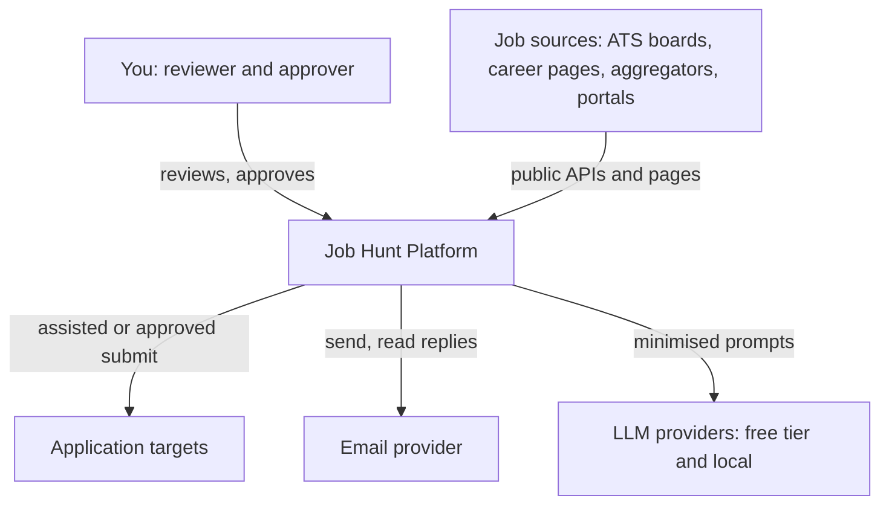

## 10. Containers and services

- **Local zone:** Docker, outbound connections only. **Cloud zone:** free tiers.
- Extension talks to the cloud BFF (no localhost dependency). UI never calls local services; it writes commands/approvals to Postgres and the control-plane outbox relay picks them up. Redis is local, so there is no command quota.

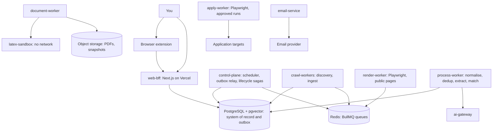

| Service | Responsibility | Owns (schema) | Consumes → Produces |
|---------|----------------|---------------|---------------------|
| web-bff | UI, thin BFF, commands and approvals | none (reads projections) | – |
| control-plane | Scheduler, outbox relay, lifecycle state machines, notifications | platform, sched | `AtsDetected`, `JobShortlisted` → `SourceRegistered`, `CrawlRequested` |
| crawl-workers | Company/career-page discovery, ATS fingerprinting, connectors | discovery, ingest | `CompanySeeded`, `CrawlRequested` → `CompanyDiscovered`, `CareerPageDiscovered`, `AtsDetected`, `JobDiscovered`, `CrawlCompleted/Failed` |
| render-worker | JS rendering of public pages only, no credentials | none | render requests → rendered snapshots |
| process-worker | Normalise, dedup, requirement extraction, matching | jobs | `JobDiscovered` → `JobNormalized`, `JobDeduplicated`, `JobUpdated`, `JobExpired`, `JobRequirementsExtracted`, `JobMatched`, `JobShortlisted` (+ `JobFilterEvaluated`, `JobEnriched` — see §13) |
| ai-gateway | All LLM traffic: routing, limits, cache, cost, prompt versions | ai | – (request/response) |
| document-worker + latex-sandbox | Resume and cover letter | docs | `JobShortlisted` → documents |
| apply-worker | Approved form filling in isolated browser contexts | apply | approvals → outcomes |
| email-service | Provider abstraction, threads, replies | outreach | approvals → delivery events |

**Rule:** services write only to their own schema; cross-schema access is by events or read-only views. Separate databases per service come at Stage 4.

| Stage | Deployables | Why |
|-------|-------------|-----|
| 1. MVP (discover → match) | web-bff, control-plane, crawl-workers, process-worker; AI gateway as an in-process module with a strict interface | Fewest moving parts; boundaries exist as modules and queues |
| 2. Isolate by risk | render-worker, ai-gateway, document-worker + latex-sandbox, apply-worker, email-service | Memory-heavy browsers, shared LLM quota, untrusted PDFs, authenticated sessions each justify isolation |
| 3. Isolate by load | Split discovery from ingest, matching from process; enforce schema-per-service | Different scaling profiles and failure blast radius |
| 4. Enterprise | Database per service, event log with replay (Kafka-class) if needed, API gateway, IaC | Only when volume, team size or replay needs justify it |

A boundary is split only if one of these is true: different scaling profile, different failure blast radius, different trust zone, different release cadence.

## 11. Discovery architecture

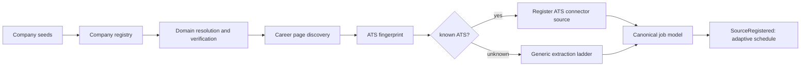

**Generic extraction ladder:** T1 JSON-LD JobPosting → T2 sitemap/feeds → T3 static HTML via learned site profile → T4 Playwright render → T5 manual/paste URL. Cheapest tier that works wins; cost/success recorded per source. T3 key idea: LLM proposes extraction config once per site, validator tests it, deterministic engine runs it each crawl, drift triggers re-learning. T4 is fallback, never core.

**Seeds:** manual additions; pasted job/career URLs (fingerprinted immediately); public directories/datasets (license `[VERIFY]`); companies observed in aggregator/ATS results (best yield); search-engine discovery only via permitted APIs `[VERIFY]`, never scraping result pages.

**Career-page discovery (deterministic first):** well-known paths (`/careers`, `/jobs`, `/join-us`), homepage/footer links, `robots.txt`/sitemaps, common subdomains (`careers.`, `jobs.`), outbound links to ATS hosts. LLM may classify ambiguous pages with fixed-enum output only.

**ATS fingerprinting (decreasing confidence):** (1) hostname/path patterns, e.g. `{tenant}.greenhouse.io`, `jobs.lever.co/{tenant}`, or spoke domains such as `careers.techmahindra.com` linked from the hub `[VERIFY per ATS]`; (2) redirects, iframes, script sources; (3) widget markers; (4) HTML/header signatures. Rules are data: `(ats, tenant, evidence, confidence)`.

**Connector contract `[HLD]`:** `fingerprint(url)`, `listJobs(source, cursor)`, `getJob(source, externalId)`, `capabilities()`. Adding an ATS = one module + fingerprint rule + registry row.

**Worked examples (reference targets):**

- Talent-pool page, zero jobs: `https://vidushiinfotech.com/careers/` — WordPress marketing page, no job list or JobPosting JSON-LD observed. Classify `talent-pool-form` (Name/Email/Mobile/Role/Experience/Resume/Consent, placeholder `#` links). Register company + `career_page(page_class=talent-pool)`, ingest zero jobs, store form spec only.
- Hub handing off to a spoke: `https://www.techmahindra.com/careers/` — hub page with no jobs, `Join Us → https://careers.techmahindra.com/`. Classify `hub-to-spoke`; the spoke becomes the canonical source (fingerprint/JSON-LD/sitemap there); hub kept as `discovered_via`.
- Keka note: Keka is one HRMS/ATS among many. It is handled by the same fingerprint + connector contract when a page is Keka-hosted; it is not the reference target. First implementation is the generic JSON-LD/sitemap/form extractor validated on the two URLs above.

| Source | Access class | Note |
|--------|--------------|------|
| Greenhouse, Lever, Ashby, SmartRecruiters | Public ATS endpoint | `[VERIFY]` docs and terms |
| Workable, Workday | Public ATS endpoint or public webpage | Tenant-specific; `[VERIFY]` fit |
| Keka and other HR-suite ATS hosts (one fingerprint among many) | Public webpage or public ATS endpoint | Generic fingerprint + contract; not the reference target |
| Adzuna, Jooble | Official API | Keys and terms `[VERIFY]` |
| LinkedIn, Naukri, Indeed, Glassdoor, Foundit, Instahyre, Hirist | No assumed public API | Likely restrictive `[VERIFY]`; manual/extension-assisted fallback only, never core ingestion |
| Company career pages | Public webpage | JSON-LD and sitemap first |

Freshness/expiry: conditional requests + sitemap `lastmod` where available; expire only after absence across N consecutive complete listings or an explicit closed marker, never one miss.

## 12. Event backbone and catalogue

**Rules:** events are past-tense facts, commands are `*Requested`, one owner per type. State change + event in one DB transaction (outbox); relay publishes to BullMQ. At-least-once delivery → consumers idempotent by `event_id`. Payloads carry IDs/minimal facts; bulky content in Postgres/object storage. Additive schema changes only, versioned envelope. No PII in payloads/logs, only references. Envelope: `event_id`, `type`, `version`, `occurred_at`, `producer`, `correlation_id`, `causation_id`, `idempotency_key`, entity refs, payload.

| Event | Producer | Consumers | Meaning |
|-------|----------|-----------|---------|
| CompanySeeded | web-bff, crawl-workers | crawl-workers | Company or URL entered the registry |
| CompanyDiscovered | crawl-workers | control-plane | Verified company and domain |
| CareerPageDiscovered | crawl-workers | crawl-workers | Candidate careers URL found |
| AtsDetected | crawl-workers | control-plane | ATS, tenant, confidence |
| SourceRegistered | control-plane | control-plane | Connector source and schedule created |
| CrawlRequested | control-plane | crawl-workers, render-worker | Source, mode, priority |
| CrawlCompleted / CrawlFailed | crawl-workers | control-plane, process-worker | Stats or failure class |
| JobDiscovered | crawl-workers | process-worker | Raw posting stored, reference emitted |
| JobNormalized | process-worker | process-worker | Canonical job created |
| JobDeduplicated | process-worker | web-bff projection | Linked to canonical job |
| JobUpdated / JobExpired | process-worker | web-bff, control-plane | Change or expiry detected |
| JobFilterEvaluated | process-worker | process-worker | Deterministic filter pass/fail/unknown with reasons (added in Part 2) |
| JobRequirementsExtracted | process-worker | process-worker | Required/preferred skills structured (deterministic pass + optional enrichment) |
| JobEnriched | process-worker | process-worker | Optional LLM enrichment for gaps (added in Part 2) |
| JobMatched | process-worker | control-plane | Match result with gaps |
| JobShortlisted | process-worker | control-plane, web-bff | Hand-off to documents/applications |
| ResumeGenerationRequested, CoverLetterGenerationRequested | control-plane | document-worker | Document jobs queued |
| ResumeGenerated, ResumeCompilationFailed, CoverLetterGenerated | document-worker | control-plane, web-bff | Document outcomes |
| ApplicationPreparationRequested | control-plane | apply-worker | Apply prep queued |
| ApplicationPrepared, HumanReviewRequested | apply-worker, control-plane | web-bff | Draft ready for review |
| ApplicationApproved | web-bff (your action) | control-plane | Approval issued |
| ApplicationSubmitted, ApplicationFailed, ApplicationPaused | apply-worker | control-plane, web-bff | Submission outcomes |
| OutreachCreated, EmailDrafted | control-plane, email-service | web-bff | Outreach drafts |
| EmailApproved | web-bff (your action) | email-service | Send approval |
| EmailSent, EmailDelivered, EmailBounced, EmailReplied | email-service | control-plane, web-bff | Delivery outcomes |
| ReplyClassified | email-service | control-plane | Intent classified |
| InterviewScheduled, OfferReceived, ApplicationRejected | control-plane | web-bff | Outcome tracking |

## 13. Job processing

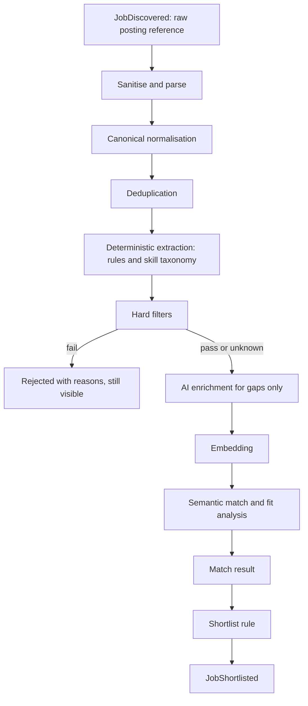

Principles: claim-check (raw stored once, events carry references); cheapest step first (LLM only on survivors, only for unresolved fields); untrusted boundary (strip scripts/hidden text pre-model); state machine `DISCOVERED → NORMALIZED → DEDUPED → FILTERED_OUT | ELIGIBLE → ENRICHED → MATCHED → SHORTLISTED | REJECTED` plus `EXPIRED`/`REOPENED`, every transition an event; idempotent stages. Canonical model: company, title (+ role family/seniority), location set, employment type, salary/currency (nullable = unknown), experience (nullable), cleaned description, apply URLs, posted/updated dates, `source_attribution`.

## 14. Deduplication

| Layer | Signal | Outcome |
|-------|--------|---------|
| 1. Source identity | `(source_id, external_id)`, e.g. `(greenhouse:acme, 12345)` | Same listing re-seen: update/no-op, never a new job |
| 2. Apply URL | Canonicalised URL (tracking stripped) | Strong cross-source match |
| 3. Content fingerprint | Normalised company + title + location set + description hash | Exact repost across sources |
| 4. Fuzzy | Embedding similarity within the same company only | Candidate duplicates, scored |

Decisions: block by company (near-linear cost; depends on company registry); merge is a link (`job_source_link` rows → one canonical job, reversible, "not-a-duplicate" allowed); apply-URL authority ATS direct > career page > aggregator > portal; same title in different locations/teams stays separate unless fields agree; thresholds tuned on a labelled sample `[LLD]`.

## 15. Matching and anti-fabrication

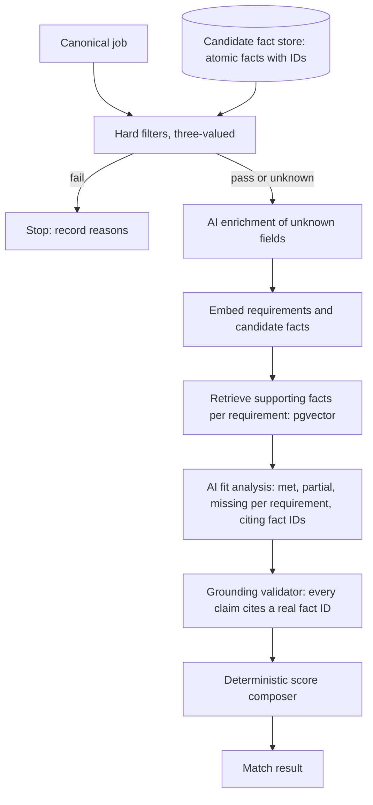

| Concern | Layer | Notes |
|---------|-------|-------|
| Location, remote/hybrid, employment type | Deterministic | Compatibility sets you define |
| Salary | Deterministic | Missing = unknown, not fail |
| Experience vs your years | Deterministic | Rules; ambiguous phrasing = unknown |
| Mandatory technologies | Deterministic | Skill taxonomy; "required" only when wording says so |
| Role family/seniority | Deterministic + taxonomy | LLM only for unmapped titles |
| Requirement structuring | Rules, then AI for gaps | Schema-validated output |
| Semantic similarity | Embeddings (local model) | Model name/version stored with every vector |
| Per-requirement fit | AI | Grounded on candidate facts only |
| Final score | Deterministic | Formula over per-requirement results, never LLM-chosen |

Anti-fabrication: fact store (your skills/roles/dates/achievements as atomic ID'd facts, authored/approved by you) is the only source of claims about you and feeds resumes/cover letters too. Fit model must cite fact IDs for every met/partial; validator rejects uncited claims, retries once, then falls back to unknown. Three-valued `PASS/FAIL/UNKNOWN` — unknown advances with a visible flag. Results show per-criterion evidence + cited facts. Shortlist = threshold + manual override, tuned from accept/reject history `[LLD]`.

## 16. AI gateway

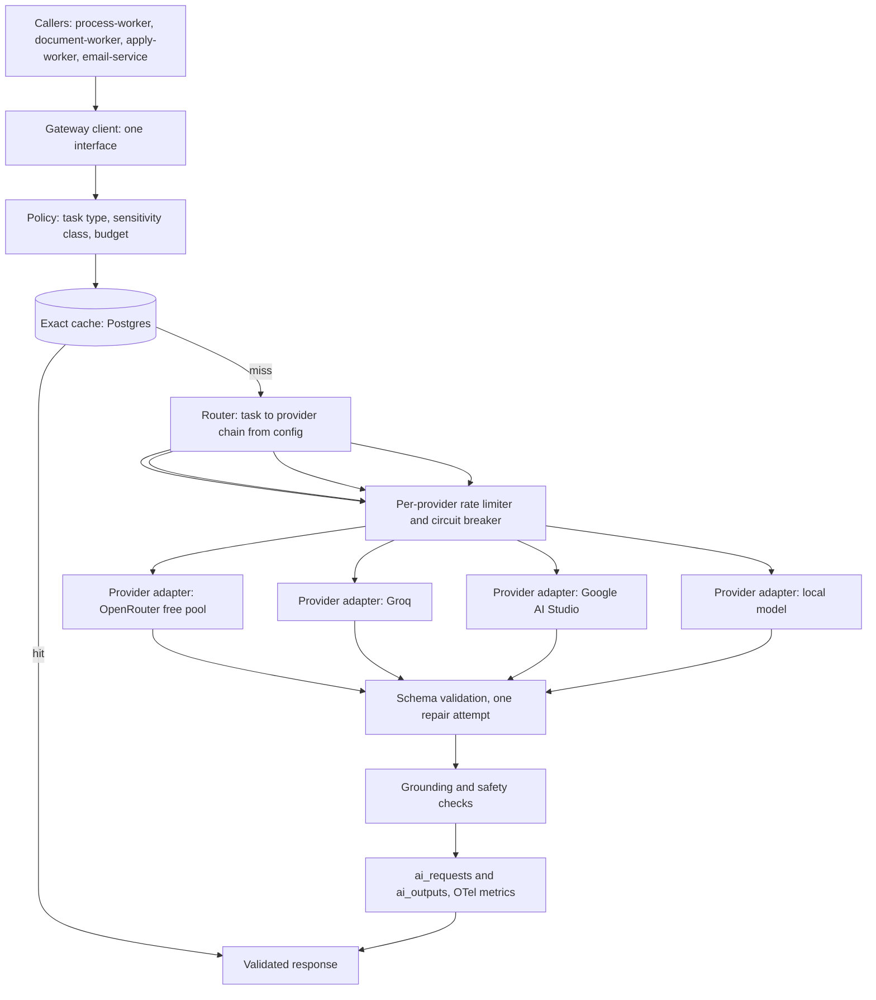

Single entry point (no direct provider SDKs; in-process module at Stage 1 with the final interface, own service at Stage 2 when shared rate-limit state is needed). Request contract: task type, prompt ID + version, input refs, output schema ID, sensitivity class, budget. Routing is config (task → ordered provider/model chain; IDs/limits `[VERIFY]`). Failures: retry 429 (honour `Retry-After`)/5xx/timeouts with backoff + jitter, then next provider; per-provider/model circuit breaker; one schema-repair attempt (preferably different provider); no retry on content-policy refusals. Cache: exact-match `hash(prompt version, task, input hash)` in Postgres (doubles as audit; no Redis cost). Usage/cost tracked per request (tokens, latency, provider, cost); quota headroom exposed for backoff. Golden-set eval per task; shadow-run new models before promotion.

| Class | Content | Eligible providers |
|-------|---------|-------------------|
| public | Job text alone | Any configured provider |
| restricted | Candidate facts, resume text, contacts | Local model, or providers whose terms exclude training/retention `[VERIFY]` |

Data minimisation (strip names/contacts pre-restricted-prompt, mapping stays local); untrusted content passed as delimited data only, never system role; untrusted-text models get no tools and return schema-validated JSON only; instruction-like text flagged in audit. LLM-proposed extraction configs schema-validated + tested pre-use.

| Use case | Deterministic first | AI role | Class |
|----------|---------------------|---------|-------|
| Requirement extraction | Regex, skill taxonomy | Fill gaps | public |
| Semantic matching | Hard filters, embeddings | Fit judgments | restricted |
| Resume tailoring | Fact-store selection, LaTeX templates | Wording within facts | restricted |
| Cover letter, email drafts | Templates, variables | Personalisation within facts | restricted |
| Career-page classification | URL heuristics, fingerprints | Ambiguous pages | public |
| Contact classification | Address patterns | Ambiguous cases | public |
| Form-field classification | `autocomplete`, labels | Ambiguous fields | public |
| Application answers | Stored answers | New questions, drafted for approval | restricted |
| Reply classification | Bounce codes, headers | Intent from reply text | restricted |

## 17. Scheduler

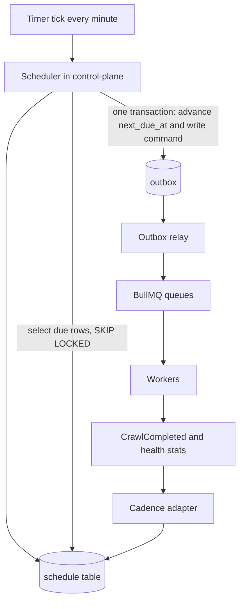

Cron never works — tick only selects due schedules and writes outbox commands. Durable Postgres schedule state (target, priority, cadence, `next_due_at`, jitter, backoff, last outcome). Single-flight per target; catch-up with coalescing (one run after downtime, jittered); optional cloud tick `[VERIFY]`. Cadence is adaptive on observed change rate, crawl cost, limits, yield:

| Target | Starting cadence | Adaptive rule |
|--------|------------------|---------------|
| High-yield ATS boards (cheap list calls) | 2–6 h | Lengthen on repeated no-change; shorten on change |
| Other ATS tenants | 6–12 h | Same |
| Career pages (JSON-LD, sitemap, static) | 12–24 h | Cap at a few days; conditional requests + lastmod |
| Pages needing render | 24 h | Only if yield justifies |
| Aggregator APIs | Quota-budgeted windows `[VERIFY]` | Spread budget by yield |
| Portals | Not scheduled by default `[VERIFY]` | Manual/extension-assisted |
| Company discovery, registry refresh | Weekly | – |
| Career-URL/connector health | Weekly + on failure | Failure triggers early check |
| ATS re-fingerprint | Monthly or on repeated failure | – |
| Expiry check | Each full crawl (absent-from-N rule) | – |
| Follow-ups/reminders | Daily | – |

## 18. Queues and retry

Queues by workload class: `crawl.api` (high concurrency, light), `crawl.render` (low concurrency, memory-bound), `discovery`, `process` (normalise/dedup/extract), `enrich` (LLM-bound, sized to provider limits). Per-host rate limiter shared by all crawlers (incl. render-worker) per site policy/`robots.txt`. Redis is disposable, Postgres holds truth; reconciler re-emits stuck work. Bounded queue depth (scheduler skips saturated enqueues). Queue behind a port (BullMQ → managed/Postgres swap without touching logic). Per-queue DLQs, inspectable in UI with replay; repeated identical failures → poison message, stop retrying.

| Failure | Action |
|---------|--------|
| Network error, timeout, 5xx | Retry with exponential backoff + jitter, bounded |
| 429 | Retry after `Retry-After`; lower that source's cadence |
| Browser/worker crash | Retry; lock expiry re-delivers |
| 404 on a job page | No retry; mark removed (expiry rules) |
| 401/403 | No retry; flag source; never work around blocks |
| robots.txt disallow | No retry; suppress path |
| Malformed posting | No retry; dead-letter with parser error |
| Schema-invalid AI output | One repair attempt, then dead-letter |

## 19. Resume and cover letter

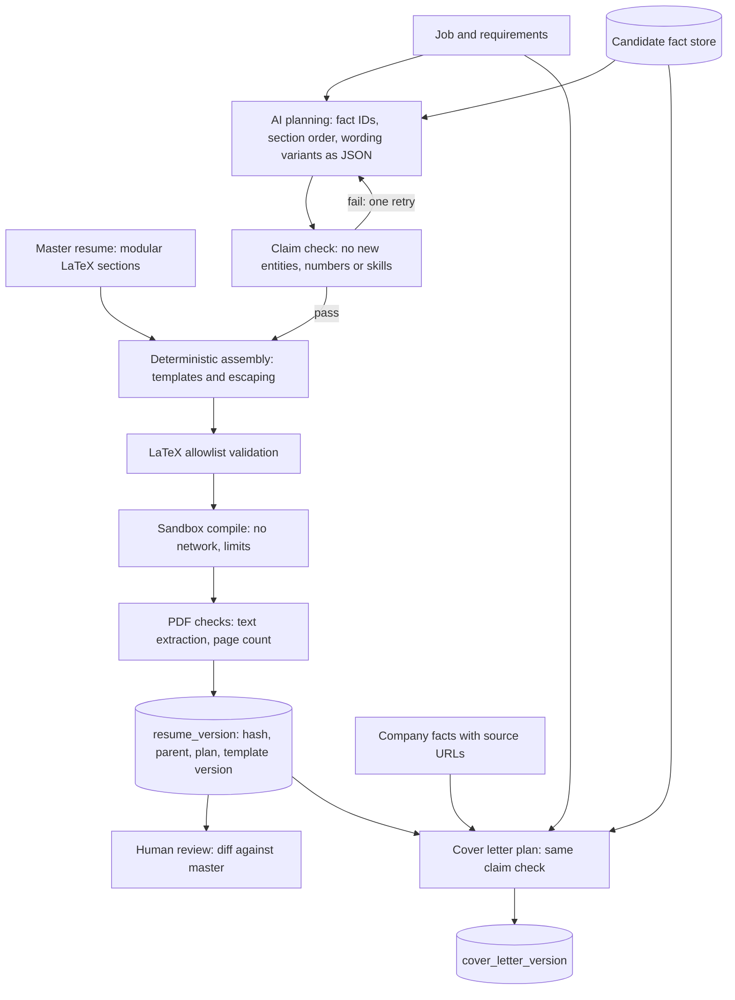

AI produces a JSON plan (fact IDs, order, pre-approved wording variants) — never raw LaTeX, so injected text can't reach the compiler. Deterministic claim check rejects new companies/titles/dates/numbers/skills. Templated assembly with LaTeX escaping; allowlist of commands/packages (reject file read/write/execute); ephemeral sandbox (`--no-shell-escape`, no network, read-only FS + scratch dir, CPU/mem/time limits `[LLD]`); compile failure dead-letters with log (no blind retry). Immutable versions (content hash, parent, job, plan JSON, template version, fact-store snapshot); diff vs master/previous; each engagement pins exactly one resume version. Master is modular files keyed to fact IDs (select/order, not rewrite). Cover letters: Markdown canonical → same sandbox PDF; company claims must cite registry source URLs; user edits create new versions (`edited_by=user`); nothing external is sent without approval.

```json
{
  "resume_version": {
    "content_hash": "sha256:...",
    "parent_version": "v12",
    "job_id": "job_123",
    "plan": { "fact_ids": ["exp_01", "proj_04"], "order": ["summary", "experience"] },
    "template_version": "resume-tpl-v3"
  }
}
```

## 20. Application automation

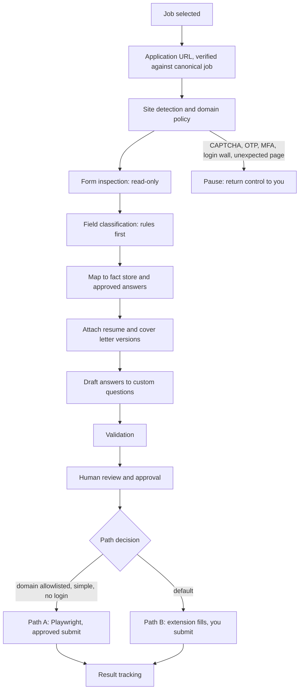

| | Path A: Playwright | Path B: browser extension |
|---|---|---|
| Use when | Domain policy allows; simple, unauthenticated, no CAPTCHA, low risk | Default: login, complex/unfamiliar form, anything uncertain |
| Session | Fresh isolated context, no stored credentials | Your own logged-in browser |
| Who submits | Worker after approval bound to exact values | You click submit |
| Inspection | Read-only, in the worker | In the extension at fill time |

Path A opt-in per domain; Path B default. Rules first (`autocomplete`, input types, label dictionaries, per-ATS maps); AI only for ambiguous fields/free-text drafts, marked for review. Sensitive questions (authorisation, disclosures, demographic, legal) answered only from stored explicit answers or the run pauses — never generated. Stop on CAPTCHA/OTP/MFA/login-wall/layout-change/unexpected content — no bypass. Official candidate submit APIs only after `[VERIFY]`.

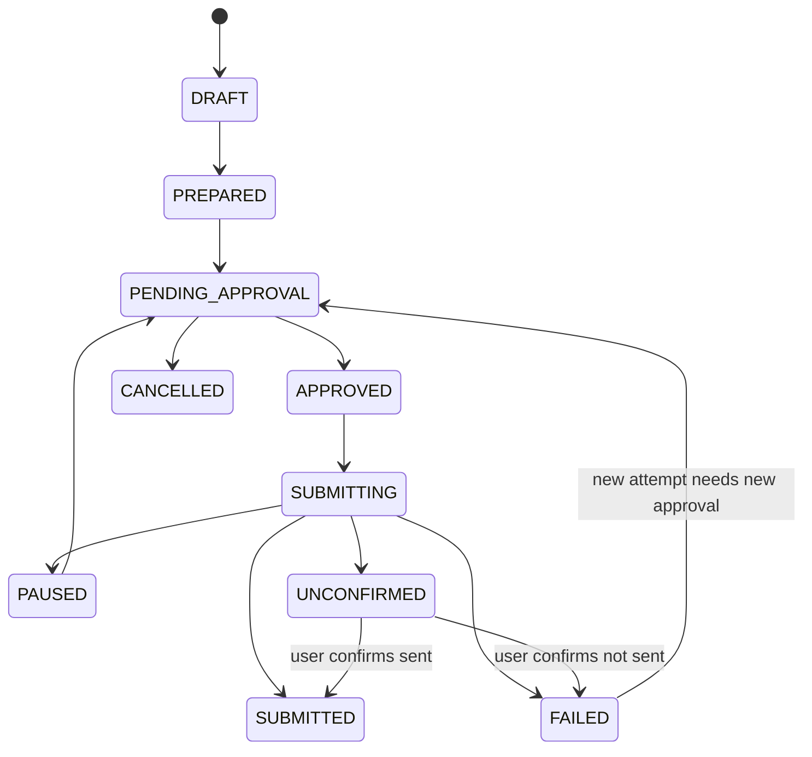

Email engagements share the states with `SENDING` for `SUBMITTING`.

## 21. Application safety

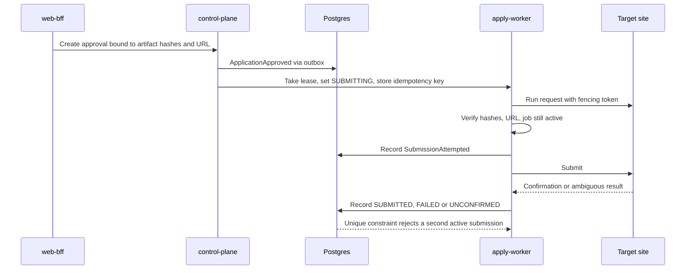

Layers: DB is the authority (partial unique on one active/completed application per candidate + canonical job; Postgres leases with fencing tokens, not Redis locks alone). Idempotency key = hash(candidate, job, URL, resume version, approval ID) at approval. Approvals bound to exact artifacts (hashes, field values, URL), single-use, expiring. Pre-submit verification (hashes, domain/path, job active). Write-ahead `SubmissionAttempted`. Ambiguous outcomes → `UNCONFIRMED`, manual resolution, never auto-retry. Cross-source protection via dedup → one canonical job.

## 22. Browser security

Separate pools for render-worker (public, anonymous) and apply-worker (your PII) — never shared browser/profile/container. Fresh context per run, no shared cookies; short-lived recycled containers; low concurrency; downloads/popups blocked; uploads limited to approved artifacts; egress allowlist to approved domain + assets `[LLD]`. DOM is data; model output never evaluated as code or used as selectors unvalidated. No stored site passwords at MVP (Path B preferred); any persistence opt-in per domain, encrypted `[LLD]`. Action recorder with redacted secrets; screenshots (PII) to restricted storage, ~30-day retention. Crash before `SUBMITTING` retries; after → `UNCONFIRMED`; page change pauses with screenshot.

## 23. Email outreach and response tracking

Outreach flow: relevant company → contact discovery (own site only: contact/careers page, footer, `mailto:`, `Organization`/`ContactPoint` structured data; respect `robots.txt`/terms) → `company_contacts(type, sourceUrl, confidence, verification)` → eligibility guard (limits, suppression, existing application) → template + grounded personalisation draft → attach versions → human approval → send guard (suppression, quota, idempotency) → `EmailProvider.send` → delivery/reply/bounce tracking → follow-up scheduler. Excluded: guessing personal addresses, third-party enrichment, leaked data, mailbox probing. Cold-email law (CAN-SPAM, GDPR/ePrivacy, DPDP) is `[VERIFY]`. Eligibility/send guards deterministic at draft + send time: per-company/day limits `[LLD]`, permanent suppression on opt-out/hard-bounce, per-contact/company-window dedup, skip when application path exists unless overridden, capped/spaced follow-ups stopping on reply/bounce/opt-out, approval bound to subject/body/recipient/attachment hashes. Provider port (`send/draft/reply/getThread/getMessages/watchInbox/getDeliveryStatus`; Gmail/Graph/SMTP adapters; capability flags and quotas `[VERIFY]`); OAuth code + PKCE, minimum scopes, encrypted refresh tokens with key outside DB `[LLD]`.

Tracking: correlation chain company → job → opportunity → engagement → message → thread → response (provider thread ID + RFC Message-ID, then `In-Reply-To`/`References`, then token fallback; heuristic-only waits for your confirmation). Two status dimensions: delivery (`SENT/DELIVERED/BOUNCED/OPENED`) and outcome (`REPLIED/INTERESTED/REJECTED/INTERVIEW/FOLLOW_UP_REQUIRED/NO_RESPONSE` derived by scheduler). No open-tracking pixels by default. Hard bounces suppress; soft bounces retry within limits. Rules-first classification (bounce codes, auto-reply headers), then restricted-class AI intent, low confidence → you.

## 24. Unified opportunity model

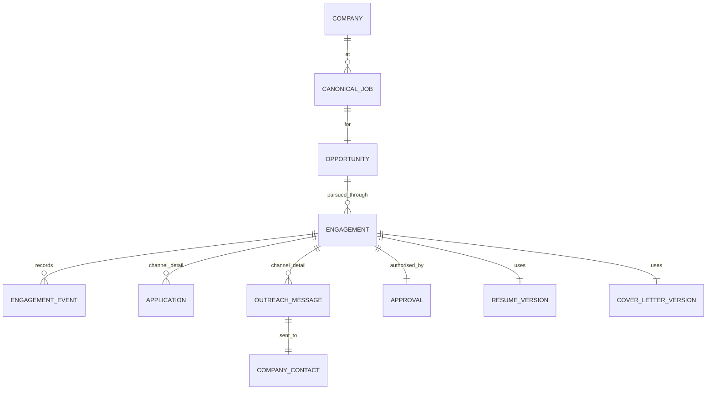

Opportunity = one candidate + one canonical job; each engagement is one channel attempt (`PORTAL_APPLICATION`/`CAREER_APPLICATION`/`EMAIL_OUTREACH`) sharing job/company/candidate/resume/cover-letter versions. Engagement outcomes roll up to opportunity status. Rules: one application per canonical job; outreach after application needs override; interested reply can convert to tracked application. Channel detail in `application`/`outreach_message`; common state/approvals/audit on engagement.

## 25. Data and ER design

Conventions `[HLD]`: one Postgres, schema per service (`platform/sched/discovery/ingest/jobs/docs/apply/outreach/ai/audit`); per-service least-privilege roles; separate DBs at Stage 4. UUIDv7-style time-ordered PKs `[LLD]`; `created_at/updated_at/created_by/updated_by`; `row_version` optimistic concurrency on state rows. Soft-delete (`deleted_at`) for user-facing entities only; append-only (never delete) events/audit/versions/suppressions. Status via `CHECK`/lookups, never free text; FKs `ON DELETE RESTRICT`. No polymorphic refs — typed nullable FKs + one-of `CHECK`. `ingestion_runs` folded into `crawl_runs`; `application_events` into `engagement_events`; `application_runs` per browser attempt.

```mermaid
erDiagram
  USERS ||--|| CANDIDATE_PROFILES : has
  USERS ||--o{ EMAIL_ACCOUNTS : connects
  CANDIDATE_PROFILES ||--o{ CANDIDATE_FACTS : holds
  CANDIDATE_PROFILES ||--o{ CANDIDATE_ANSWERS : stores
  CANDIDATE_FACTS ||--o| FACT_EMBEDDINGS : embedded_as
  COMPANIES ||--o{ COMPANY_DOMAINS : has
  COMPANIES ||--o{ COMPANY_SOURCES : discovered_via
  COMPANIES ||--o{ CAREER_PAGES : has
  COMPANIES ||--o{ COMPANY_CONTACTS : has
  CAREER_PAGES }o--o| ATS_FINGERPRINTS : detected_as
  CAREER_PAGES ||--o| SITE_PROFILES : learned_config
  COMPANIES ||--o{ JOB_SOURCES : owns
  JOB_SOURCES }o--|| SOURCE_CONNECTORS : served_by
  JOB_SOURCES ||--o| SCHEDULES : scheduled_by
  JOB_SOURCES ||--o{ CRAWL_RUNS : has
  CRAWL_RUNS ||--o{ RAW_POSTINGS : fetched
  JOB_SOURCES ||--o{ JOB_SOURCE_LINKS : lists
  JOBS ||--o{ JOB_SOURCE_LINKS : seen_at
  RAW_POSTINGS ||--o{ JOB_SOURCE_LINKS : resolves_to
  COMPANIES ||--o{ JOBS : posts
  JOBS ||--o{ JOB_REQUIREMENTS : has
  JOBS ||--o| JOB_EMBEDDINGS : embedded_as
  JOBS ||--o{ JOB_MATCHES : evaluated
  CANDIDATE_PROFILES ||--o{ JOB_MATCHES : receives
  JOB_MATCHES ||--o{ JOB_MATCH_CRITERIA : explained_by
  RESUMES ||--o{ RESUME_VERSIONS : versions
  RESUME_VERSIONS ||--o| ARTIFACTS : rendered_as
  COVER_LETTERS ||--o{ COVER_LETTER_VERSIONS : versions
  COVER_LETTER_VERSIONS ||--o| ARTIFACTS : rendered_as
  CANDIDATE_PROFILES ||--o{ OPPORTUNITIES : pursues
  JOBS ||--o{ OPPORTUNITIES : target_of
  OPPORTUNITIES ||--o{ ENGAGEMENTS : pursued_through
  ENGAGEMENTS ||--o{ ENGAGEMENT_EVENTS : records
  ENGAGEMENTS }o--|| RESUME_VERSIONS : uses
  ENGAGEMENTS }o--o| COVER_LETTER_VERSIONS : uses
  ENGAGEMENTS ||--o| APPROVALS : authorised_by
  ENGAGEMENTS ||--o| APPLICATIONS : channel_detail
  APPLICATIONS ||--o{ APPLICATION_ANSWERS : has
  APPLICATIONS ||--o{ APPLICATION_RUNS : attempts
  OUTREACH_CAMPAIGNS ||--o{ OUTREACH_MESSAGES : groups
  ENGAGEMENTS ||--o{ OUTREACH_MESSAGES : channel_detail
  OUTREACH_MESSAGES }o--|| COMPANY_CONTACTS : sent_to
  OUTREACH_MESSAGES }o--|| EMAIL_THREADS : in
  EMAIL_THREADS }o--|| EMAIL_ACCOUNTS : via
  EMAIL_THREADS ||--o{ EMAIL_EVENTS : records
  AI_REQUESTS ||--o| AI_OUTPUTS : produces
```

`SCHEDULES` also targets companies/follow-ups via typed FKs (one-of `CHECK`), omitted for readability.

Selected constraints/indexes: `job_source_links` UNIQUE `(source_id, external_id)`; `raw_postings` UNIQUE `(source_id, external_id, content_hash)`; `jobs` `(company_id, status)` + partial `ACTIVE` + generated `tsvector`/GIN; `job_embeddings` PK `(job_id, model)` + HNSW; companies UNIQUE normalised domain + trigram name; `company_contacts` UNIQUE `(company_id, lower(value))`; `suppression_entries` UNIQUE `(kind, value_hash)`, no update/delete; `opportunities` UNIQUE `(candidate_id, job_id)`; `engagements` partial UNIQUE on application channels in active states + UNIQUE `idempotency_key`; `approvals` bound hashes + `expires_at`/`consumed_at`; `resume_versions` UNIQUE `(resume_id, version_no)` + self-FK parent + no-update trigger `[LLD]`; threads/messages UNIQUE provider-thread/RFC IDs; events indexed by parent/time, append-only; `outbox_events` partial index on unpublished; `processed_events` PK `(consumer, event_id)`; `schedules` partial `(next_due_at) WHERE enabled` + per-target UNIQUE; large append tables indexed by parent/time, partitioned later `[LLD]`; `ai_outputs` UNIQUE `cache_key`.

JSONB for raw payloads/configs/site profiles/event payloads/AI bodies/evidence spans/plan JSON; relational for everything filtered/joined/constrained (companies, jobs, requirements, matches, contacts, engagements, approvals, versions). pgvector justified for similar jobs/companies, in-company fuzzy dedup, fact retrieval; model+version stored per row; vectors only for post-filter jobs (~1.5 KB/row at 384 dims — matters for free-tier caps `[VERIFY]`).

## 26. Search

Postgres suffices at MVP: generated `tsvector` (title > company > description) + GIN; btree/partial filters (status, location, type, salary, company); trigrams for typos; pgvector nearest-neighbour within filters; hybrid RRF ranking `[LLD]`. Dedicated engine (Meilisearch first, OpenSearch for heavy aggregations) only on measured trigger (latency after tuning, faceted/typo scale, relevance outgrowing Postgres). Hosting/free tiers `[VERIFY]`.

## 27. Storage and retention

| Prefix | Content | Access | Retention (starting) |
|---|---|---|---|
| `artifacts/` | Resume/cover-letter PDFs, content-hash keys, immutable | Private; short-lived BFF signed URLs | Kept |
| `snapshots/` | Raw page snapshots, large raw postings | Private, service-only | 30–90 days |
| `screenshots/` | Browser-run evidence (PII) | Restricted role | ~30 days post-outcome |
| `exports/` | Encrypted backups/exports | Private | Rotating |

Large content → object storage + Postgres pointer; small payloads stay JSONB (keeps free DB small `[VERIFY caps]`; object-storage limits `[VERIFY]`). Retention: raw/snapshots 30–90d; expired jobs keep row + fingerprints, drop descriptions after a period; AI bodies ~30d (metadata longer); emails while opportunity active then archive/delete at your choice; screenshots ~30d; outbox/processed 7–30d; crawl detail ~90d then aggregates; audit logs long (~1–2y), PII-redacted; suppressions + resume versions kept. Forget flow: deleting company/contact purges data, keeps suppression hash.

## 28. Security and PII

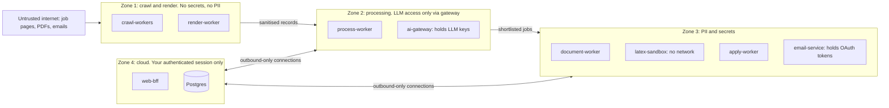

Single user via managed IdP + MFA `[VERIFY free-tier]`; short sessions; per-service worker credentials. Ownership checks + Postgres RLS defence-in-depth; per-schema DB roles. Approvals require user session with recent re-auth; workers can't create them. TLS + at-rest encryption; envelope encryption for OAuth tokens/session state, key outside DB `[LLD]`. No secrets in repo/plaintext DB; LLM keys only in ai-gateway, connector keys in ingest, mail tokens in email-service; local secret files/encrypted tooling, Vercel env for UI. SameSite + CSRF tokens on mutations (+ re-auth for approvals). Sanitised-text rendering, no raw external HTML, strict CSP. Parameterised queries only. SSRF egress filter for crawlers (http(s) only, block private/loopback/link-local/metadata ranges, resolve-and-pin DNS, re-validate redirects, size/time caps). Edge BFF limits + per-host crawler limits + per-provider AI/email limits. Zone 1 disposable, no secrets/PII. Inbound attachments never auto-opened, hash-stored, quarantined; outbound PDFs only from LaTeX sandbox. Lockfiles, audits, pinned digests `[LLD]`. Append-only audit (approvals, sends, submissions, auth, suppressions, exports), PII-redacted, correlation IDs. PII classes P0 public job text · P1 public business contacts · P2 candidate PII · P3 secrets: PII only in designated tables/objects; events/logs carry references; redaction filter at logging boundary; AI prompts follow sensitivity classes. Third-party processor inventory with data terms `[VERIFY]`.

## 29. Observability

OTel traces/metrics/logs with local open-source backend at $0 (hosted free tier optional `[VERIFY]`). Trace context rides in `correlation_id` across queue hops. Audit (permanent business record) separate from sampled/expiring telemetry. Dashboards + alerts per area (ingestion freshness, crawler failure classes incl. parse-spike, queue depth/age/DLQ, worker crashes, AI latency/tokens/fallback/schema-fail/cache/quota, compile rate, attempts/outcomes/pauses with **any `UNCONFIRMED`** alerting, email quota/bounces, browser crashes, reconciler stuck-count). Low-cardinality labels only (source/connector/provider, never job ID).

## 30. Failure and recovery

Classify then respond: transient (timeout/5xx/429/crash) → backoff + jitter → circuit-breaker check (open → pause source/provider, lower cadence, alert; closed → idempotent re-run). Permanent (4xx/malformed/schema-invalid) → dead-letter with reason → inspect/fix/replay. Ambiguous side effects (submit/send) → `UNCONFIRMED`, you decide. Key table: source timeout → bounded backoff + per-source breaker; 429 → honour `Retry-After` + lower cadence; AI timeout/429 → next provider; AI hallucination → claim/grounding check fails → one repair → unknown/dead-letter; LaTeX fail → dead-letter with log; browser crash pre-submit → re-run, post-`SubmissionAttempted` → `UNCONFIRMED` no retry; page-change/CAPTCHA/OTP/MFA → pause; email send failure → retry only if provider confirms unsent else `UNCONFIRMED`; DB outage → workers pause, re-runnable crawls; Redis loss → reconciler rebuilds from Postgres/outbox; worker crash → lock expiry + idempotent redelivery. Compensation is limited (sends/submits can't be undone) — prevention via approval binding, unique constraints, `UNCONFIRMED`. Orphaned drafts/versions marked, not deleted.

## 31. Deployment, zero-cost, DR

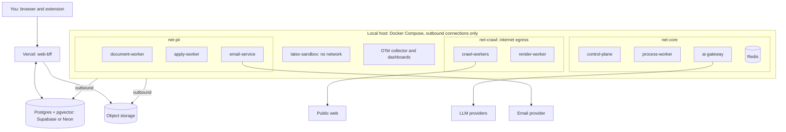

Zero-cost split: open-source self-hosted (Docker, Postgres/Redis/BullMQ, Playwright, Cheerio, Transformers.js, pdflatex, OTel/Grafana-style, optional local LLM) vs free-tier-with-limits `[VERIFY all]` (Vercel, Supabase/Neon, R2, OpenRouter/Groq/AI Studio, Adzuna/Jooble, Gmail API, Upstash, hosted observability) vs potentially-paid (over-quota LLM, always-on host, email volume, hosted queue/search) vs optional upgrades (managed Redis, VPS, dedicated search, paid LLM). All free→paid swaps are adapter + config changes behind ports. Hybrid rationale: browsers/LaTeX/long workers fit free cloud tiers poorly `[VERIFY]`; local box runs them free at the cost of availability (state in Postgres + catch-up scheduler covers downtime). Scaling: crawlers by workers within per-host limits; embeddings batched on local CPU; LLM bounded by provider quota; first hard ceiling likely free-DB storage (retention + object storage mitigate). DR targets (personal): RPO ~24h, RTO hours, tunable. Nightly encrypted logical backup to object storage + provider PITR if offered `[VERIFY]`; Redis disposable; config/prompts/migrations/code in git; separate encrypted secrets backup. Restore: restore Postgres → migrate → start reconciler → workers resume; test periodically. Fact store/master resume/answers/suppressions get separate encrypted exports.

## 32. API and technology notes

BFF: resource REST over HTTPS (`/v1/jobs`, `/companies`, `/opportunities`, `/approvals`), OpenAPI contract; mutations require `Idempotency-Key` and create Postgres commands; cursor pagination. Service-to-service by events except request/response to ai-gateway; versioned JSON Schema/AsyncAPI event schemas `[LLD]`. One backend framework (Fastify with explicit ports/adapters, or NestJS for enforced modules — pick one); pnpm-workspace monorepo with shared event-schema/port/domain-type packages `[LLD]`. Analytics and notifications are not separate services yet: SQL views/read models + control-plane module.

## 33. Roadmap and MVP

| Phase | Scope | Exit criterion | What you learn |
|-------|-------|----------------|----------------|
| 0 Foundations | Repo, Compose, migrations, outbox + relay, OTel skeleton, CI | Event travels API → outbox → queue → worker with trace | Outbox, idempotency, tracing |
| 1 Discovery and ingestion | Company registry, paste-URL fingerprinting, generic career-page extractor spike validated on vidushiinfotech.com/careers (talent-pool) and techmahindra.com/careers (hub-to-spoke), JSON-LD extractor, basic scheduler | Talent-pool vs hub-spoke correctly classified; jobs (or explicit zero-jobs) in UI | Connector contract, adaptive scheduling |
| 2 Processing and matching | Normalise, dedup, filters, fact store, embeddings, grounded matching, in-process AI gateway | Shortlist with per-criterion evidence | Hybrid AI, pgvector |
| 3 Documents | LaTeX sandbox, resume versions, cover letters | Versioned PDFs with claim-check audit | Sandboxing, immutability |
| 4 Assisted apply | Extension (Path B), approvals, state machine, safety layers | End-to-end assisted application, zero duplicates under forced retries | Distributed safety |
| 5 Outreach | Contact discovery, one email adapter, tracking, suppression | Threaded replies correlate correctly | Provider abstraction, correlation |
| 6 Hardening | Stage 2 splits, opt-in Path A, more connectors, full dashboards | Chaos drills pass (kill worker, kill Redis) | Failure engineering |
| 7 Scale | Stage 3/4 moves as measured | Driven by metrics | Service extraction |

Future enterprise (Stage 4): DB per service, replayable event log if justified, API gateway, IaC, dedicated search, managed queue, secret rotation, multi-tenancy only if ever needed.

## 34. Final architecture and unified decision table

End-to-end: company discovery → career-page discovery → ATS detection → source registration → scheduled crawl → ingestion → normalisation → dedup → deterministic extraction/filters → AI enrichment/matching → shortlisting → resume/cover-letter → application prep → human review → extension or approved Playwright / outreach → response/outcome tracking → interviews → analytics (read models), with cadence feedback to scheduling.

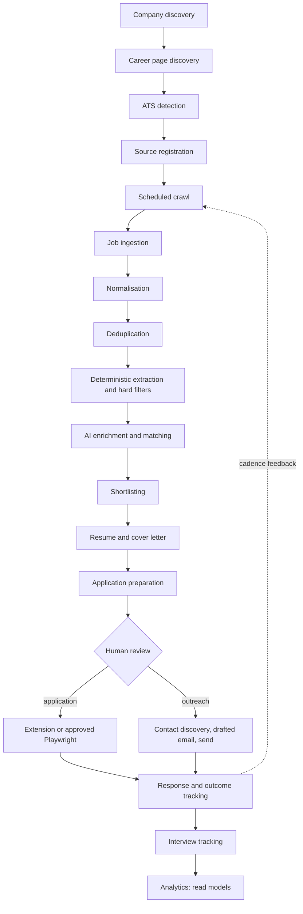

| Decision | Chosen | Alternative | Why | Trade-off | Revisit when |
|----------|--------|-------------|-----|-----------|--------------|
| Cloud/local link | Outbound-only workers, Postgres rendezvous | Tunnel to local API | No exposed machine; survives downtime | Relay latency | Always-on host exists |
| Queue | BullMQ on local Redis behind a port, Postgres outbox | Upstash; Postgres-only queue | No quota, keeps your stack | Redis runs locally | Workers move to cloud |
| Granularity | Modular, staged split | Many services now | One developer can run it | Some boundaries logical at first | A split trigger is met |
| Discovery | Registry, fingerprints, connector-first ladder | Per-company scrapers | No per-company code | Site profiles need drift monitoring | Failure rate rises |
| Reference targets | Generic career pages (vidushiinfotech talent-pool, techmahindra hub-to-spoke) | Keka-specific connector first | Matches real targets; Keka is one ATS among many | Two page classes to handle | New dominant source appears |
| Filter vs LLM order | Deterministic filters first, LLM on survivors | Enrich every job | Saves free-tier quota | More states | Filters prove too coarse |
| Unknown handling | Three-valued logic | Fail on missing data | Doesn't lose good jobs | Some shortlist noise | Noise too high |
| Dedup | Layered identity, company blocking | Slug hash only | Handles variants/cross-source | Needs company resolution | Volume grows |
| Anti-fabrication | Fact store + cited IDs + validators | Prompt rules only | Verifiable, auditable | Upfront profile work | – |
| Scoring | Deterministic composer | LLM-assigned score | Stable, explainable | Formula tuning | Enough history |
| AI placement | Rules first; gateway for all LLM calls | Direct calls | Quota, audit, safety in one place | Extra hop | Volume/cost changes |
| AI data safety | Sensitivity classes and routing | One provider for all | Protects PII on free tiers | Fewer eligible providers | Paid tier with strong terms |
| Cache | Postgres exact cache | Redis semantic cache | Audit trail, no quota use | Lower hit rate | Measured need |
| Scheduler | DB-backed, coalescing, single-flight | In-process cron | Survives restarts/downtime | Slightly more code | – |
| Queue recovery | Outbox + reconciler | Trust Redis | No lost work | Extra background process | – |
| Resume generation | AI plan (JSON) + deterministic LaTeX assembly | AI writes LaTeX | Blocks injection/fabrication | Less free-form tailoring | Plan proves too limiting |
| Claims | Fact IDs + claim check | Prompt rules | Verifiable, auditable | Upfront fact-store effort | – |
| Approval | Bound to artifact hashes, single-use | Simple approve flag | Can't approve one thing and send another | More states | – |
| Submit path | Extension default, Playwright opt-in per domain | Auto-submit default | Safe with logins/unknown forms | More manual clicks | Domains prove reliable |
| Duplicate prevention | DB constraints, leases, idempotency, `UNCONFIRMED` | Redis lock and retries | Redis is disposable | More DB design | – |
| Ambiguous outcome | `UNCONFIRMED`, manual resolution | Auto-retry | Never double-submits | Occasional manual check | – |
| Email status | Delivery + outcome as two dimensions | One status enum | They change independently | Two fields | – |
| Contact discovery | Public site sources, no guessing | Enrichment services | Legal/ethical safety | Fewer contacts | Verified compliant source exists |
| Open tracking | Off by default | Tracking pixels | Privacy, reliability | Less signal | You want it + provider supports it |
| Lifecycle | Opportunity + engagements | Separate app/outreach models | One audit trail and rollup | Slightly more abstract | – |
| Database | One Postgres, schema per service | Database per service | Simple, still enforces ownership | Shared failure domain | Stage 4 |
| Search | Postgres full-text + pgvector | Search cluster now | No extra infrastructure | Limited relevance tuning | Measured trigger |
| Observability | OTel, local backend, separate audit | Hosted APM | $0, portable | You operate it | Time cost outweighs benefit |
| Analytics, notifications | SQL views, control-plane module | Separate services | Avoids empty services | Coupling | Load/team grows |
| Secrets | Least-privilege per service, envelope encryption | Shared env file | Limits blast radius | More setup | Secret manager needed |

---

## Appendix A. Deferred to LLD

Schema DDL (columns/types, HNSW params, partitioning, triggers, RLS), index parameters, BullMQ options (concurrency/backoff), rate-limiter algorithm, reconciler thresholds, fingerprint regexes, Playwright selectors/timeouts, egress rules, site-profile schema, skill taxonomy format, embedding model + dimension, score weights, prompt texts + JSON schemas, cache-key details, approval/lease/idempotency formats, plan and claim-check schemas, state-transition tables, LaTeX allowlist + container flags/limits, OAuth scopes + token encryption, DSN parsing, correlation tokens, quota numbers, alert thresholds, dashboard layouts, backup schedules, Compose structure, monorepo layout.

## Appendix B. Consolidated VERIFY checklist

Resolve before relying on: Supabase/Neon free Postgres + pgvector limits (storage, pausing, connections); Vercel free personal-use terms; free LLM tier logging/training + model-change policy (OpenRouter/Groq/AI Studio); Adzuna/Jooble keys and terms; ATS endpoint docs/terms (Greenhouse/Lever/Ashby/SmartRecruiters/Workable/Workday); HR-suite ATS page structure per tenant; aggregator/ATS legal fit; LinkedIn/Naukri/Indeed/Glassdoor/Foundit/Instahyre/Hirist restrictive terms (manual/extension fallback only); search-engine discovery only via permitted APIs; Gmail/Graph personal-use verification + scopes; SMTP/watch/push capability per provider; free sending quotas; BullMQ grouping support in your edition; Upstash quotas (kept as optional swap); OTel hosted free-tier option; always-on host need; Meilisearch/OpenSearch hosting terms; R2/object-storage caps; cold-email law (CAN-SPAM, GDPR/ePrivacy, DPDP) before any scale.

*End of consolidated HLD v0.1. Source sections: Parts 1–4. Next: LLD starter (schema DDL + connector contract) or generic career-page extractor spike plan (vidushiinfotech + techmahindra).*
